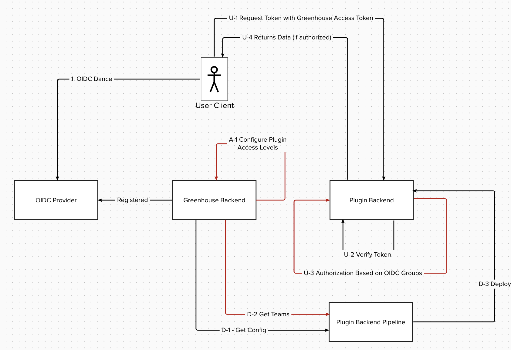
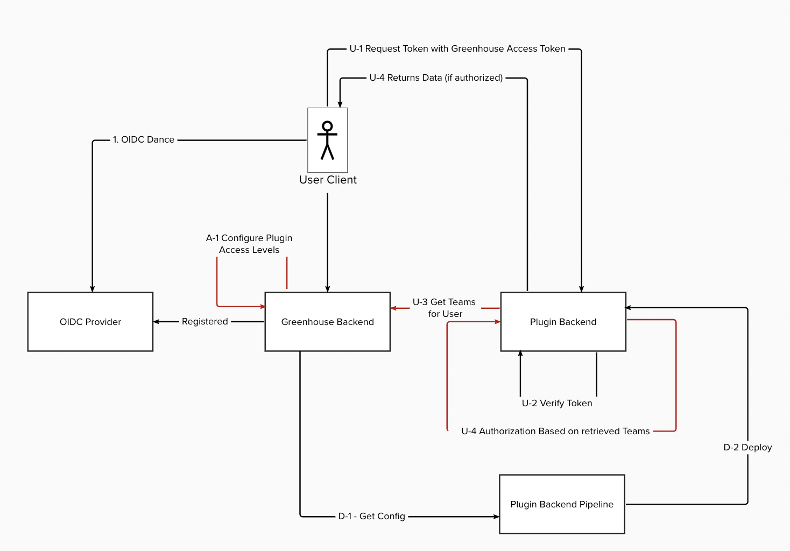
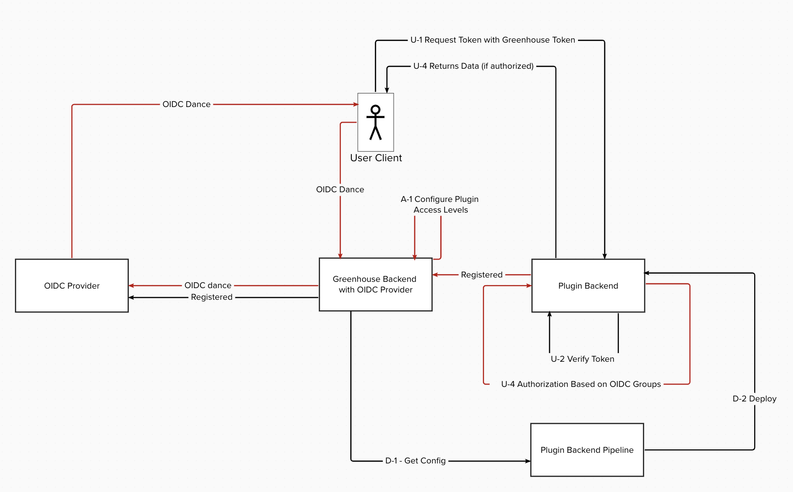

# 002 Technical Implementation of access Authorization for Greenhouse Plugins

- Status: poc
- Deciders: Fabian Ruff, Esther Schmitz, Arno Uhlig, Uwe Mayer, David Rochow
- Date: 2024-07-14
- Tags: greenhouse

## Context and Problem Statement

Greenhouse is a Platform that aims to aggregate a variety of Applications into a single Platform using a Plugin Concept
that allows Applications to be integrated into Greenhouse while being maintained and developed in a distributed manner.

Furthermore, it intentionally does not support multi-tenancy across Plugin Instances to enable segregation between
tenants and make the Platform usable by totally unrelated LoB's.

This Decision record is about the technical solution how we do Authorizations for Plugins.

## Decision Drivers

- Enables support of multiple Identity Providers
    * To allow Organizations to use their own IdP
- Open for adoption
    * allows also Plugin Backends to be used that are not developed internally
- Support of Role Mapping within Greenhouse
    * Supports the usage for the considered solutions of ADR-1
- Supports running Greenhouse components in a single Kubernetes Cluster
    * On kubernetes you can only configure one OIDC Provider
- Implementation effort
- Maintenance effort

## Considered Options

- Team Sync during Deployment
- Team Sync by Plugin during runtime
- Usage of internal IdP for Group Ownership Rewriting based on Greenhouse mappings

## Decision Outcome

Chosen option: **"Usage of internal IdP for Group Ownership Rewriting based on Greenhouse mappings"**

### Positive Consequences

- Overall best decision driver ratings
- Most flexible solution
- Does not require additional syncing of mappings between Greenhouse and Plugins
- We are in control of the OIDC Provider that is used for Authorization of Requests on Plugins
- The authentication is still happening on the external Identity Provider
- Only of the Solutions that solves the Kubernetes problem(just supports one OIDC Provider) by design

### Negative Consequences

- Introduction of an additional Open Source Project
- In case we need to support Plugin Backends outside Converged Cloud, we would need to expose the internal OIDC
  Provider (somehow) or build an additional proxy solution.
- This solution is expected to require the most implementation and maintenance effort

## Pros and Cons of the Options

### Team Sync during Deployment

This Solution is using an external OIDC Provider.
Within Greenhouse, mappings from OIDC Groups to Plugin Permissions are done,  
and the respective mappings are distributed to Plugins during the deployment of the Plugins.

This means any change in the mapping of a Team/Role would require a re-deployment of the Plugins to happen.

| Decision Driver                                                       | Rating | Reason                                                                                                                      |
|-----------------------------------------------------------------------|--------|-----------------------------------------------------------------------------------------------------------------------------|
| Enables support of multiple Identity Providers                        | +      | possible                                                                                                                    |
| Open for adoption                                                     | +      | Would use 100% standard OIDC for Authorization on Plugin Side. Organizations would be forced to use a OIDC Provider though. |
| Support of Role Mapping within Greenhouse                             | +      | supports with variations in the details all options                                                                         |
| Supports running Greenhouse components in a single Kubernetes Cluster | -      | unclear, how this would be solved                                                                                           |
| Implementation effort                                                 | o      |                                                                                                                             |
| Maintenance effort                                                    | -      | The required redeployment of components                                                                                     |

### Team Sync by Plugin during runtime

In this Solution we use a external OIDC provider as well.
The mapping of Access Levels for Plugins is also done within Greenhouse.
The difference is that the mapping of OIDC Groups to permissions is fetched from the Plugin at runtime from
Greenhouse using API endpoint implemented for this purpose.

| Decision Driver                                                       | Rating | Reason                                                                                 |
|-----------------------------------------------------------------------|--------|----------------------------------------------------------------------------------------|
| Enables support of multiple Identity Providers                        | +      | possible                                                                               |
| Open for adoption                                                     | -      | Would use for the Authorization a custom implementation through retrieving the mapping |
| Support of Role Mapping within Greenhouse                             | +      | supports with variations in the implementation details all options                     |
| Supports running Greenhouse components in a single Kubernetes Cluster | -      | unclear how this would be solved                                                       |
| Implementation effort                                                 | -      | We would need to create an additional API Endpoint                                     |
| Maintenance effort                                                    | o      | Neutral                                                                                |

### Usage of internal IdP for Group Ownership Rewriting based on Greenhouse mappings

This Solution does use a federated IdP that handles the authorization.
The Idea here is to us any external Authentication Provider (which could also be something else than an OIDC provider)
and use an internal OIDC Provider that is used for the Plugins and Kubernetes.
Within the internal OIDC Provider, we can then create the Group to Role mappings for plugins before issuing a token.
This way, the token would include all custom Permission mappings that we configure in Greenhouse using a standardized
approach.
This also means that Plugins can either advertise their expected naming schema with their Plugin Schema or
use a default pre-defined schema that all Greenhouse Plugins are using.

| Decision Driver                                                       | Rating | Reason                                                                                                                                                           |
|-----------------------------------------------------------------------|--------|------------------------------------------------------------------------------------------------------------------------------------------------------------------|
| Enables support of multiple Identity Providers                        | +++    | Even allows usage of other Protocols than OIDC                                                                                                                   |
| Open for adoption                                                     | +++    | Openness for different Identity providers enables Organizations to have a very flexible choice                                                                   |
| Support of Role Mapping within Greenhouse                             | +      | Supports all the variants                                                                                                                                        |
| Supports running Greenhouse components in a single Kubernetes Cluster | +++    | We would internally use only our internal OIDC Provider for issuing tokens which would solve the problem that Kubernetes Clusters only support one OIDC Provider |
| Implementation effort                                                 | -      | Probably more effort to implement than other solutions                                                                                                           |
| Maintenance effort                                                    | -      | Probably more maintenance effort than the other solutions especially due to the additional open source dependencies introduced                                   |

## Related Decision Records

**001 Logical Authorization Concept for Greenhouse Plugins**
