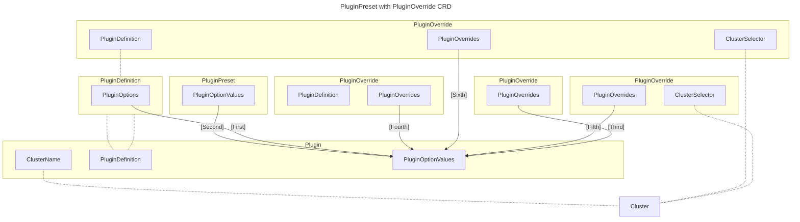
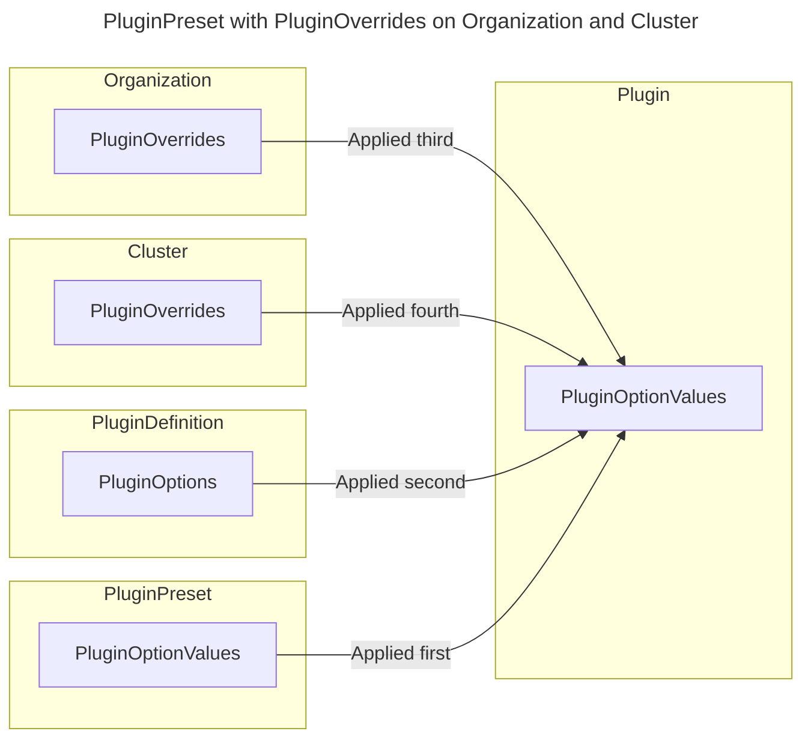
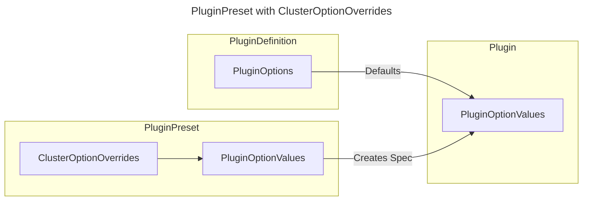

# 007 Plugin Overrides

- Status: draft
- Deciders: - Akshay Iyyadurai Balasundaram, Arno Uhlig, Richard Tief, Tommy Sauer, Uwe Mayer, Ivo Gosemann
- Date: 2024-08-14
- Tags: greenhouse

## Context and Problem Statement

In Greenhouse Plugins are the primary way to extend the functionality of the Operations Platform. Since there are some Plugins that are required in most clusters, such as `CertManager`, there are PluginPresets. These PluginPresets are a way to define a default configuration for a Plugin, which is deployed to all clusters matching the PluginPreset's selector.

The issue now is that there are some cases where the default configuration between two clusters only differs in one or very few values, e.g. a cluster-specific secret. This is currently not possible with PluginPresets, as they are applied with the same configuration to all clusters matching the selector.

Another issue is setting default values that are valid for all plugins inside of an Organization, or for all plugins for a specific cluster. Currently, this requires setting these values in every Plugin's spec.

Greenhouse should offer a way to override PluginOptionValues for a specific cluster, for all Plugins of a certain PluginDefinition, or for all plugins in an Organization.

## Decision Drivers

- Stability:
  - Overrides should be consistent
  - Overrides should be applied in a deterministic way (most specific last)
  - There should be no conflicts between overrides or constant reconciliation loops
  - Changes to the overrides should be applied to all relevant plugins

- Transparency:
  - End-users should be able to see/understand which overrides are applied to a Plugin

- Compatibility:
  - Overrides should be compatible with existing Plugins
  - Overrides should be compatible with existing PluginPresets

## Considered Options

- Introduce a new CRD called `PluginOverride`
- New override fields on the CRDs `Organization` and `Cluster`
- Additonal `ClusterOptionOverrides` Field on PluginPreset

## Decision Outcome

Chosen option: "Additonal `ClusterOptionOverrides` Field on PluginPreset", because it is the simplest solution and allows for a fine-grained configuration for a list of clusters, while only touching one CRD.
This solves the underlying problem which we are facing with the current implementation of PluginPresets.

### Positive Consequences <!-- optional -->

- one place to configure the PluginPreset's PluginSpec and also the Overrides
- no additional CRD required
- no additional RBAC roles required
- no added complexity to finding out which objects will be affected by the override
- no added complexity to finding out why a Plugin has a certain configuration
- implementation is compatible with all existing PluginPresets/Plugins

### Negative Consequences <!-- optional -->

- This solves the problem only for PluginPresets, but not for general defaulting on Cluster or Organization level

## Pros and Cons of the Options | Evaluation of options <!-- optional -->

### Introduce a new CRD called `PluginOverride`

A new CRD called `PluginOverride` will be introduced. This CRD specify Overrides that are used to override PluginOptionValues for a specific cluster, for all Plugins of a certain PluginDefinition, or for all plugins in an Organization.

We will introduce a new CRD called `PluginOverride`. This CRD will allow users to override PluginOptionValues.
It will be possible to:

- define a ClusterSelector to specify the relevant clusters
- specify PluginDefinitionNames to only apply values to Plugins instantiated from any listed PluginDefinition
- apply the overrides to all Plugins in an Organization

The Clusters relevant for the override should be determined by the ClusterSelector. The ClusterNames are the names of the clusters that should be affected by the override. The IgnoreClusters are the names of the clusters that should not be affected by the override. The LabelSelector is a metav1.LabelSelector that should be used to select the clusters.

```golang
type ClusterSelector struct{
  LabelSelector * metav1.LabelSelector `json:"labelSelector,omitempty"`
  ClusterNames []string `json:"clusterNames,omitempty"`
  IgnoreClusters []string `json:"ignoreClusters,omitempty"`
}
```

This could look like:

```yaml
kind: PluginOverride
name: my-overrides
spec:
  pluginDefinitionNames:
    - my-plugindefinition # if empty applies to all plugins
  clusterSelector: # if empty applies to all clusters
    - matchLabels:
        my-cluster-label: my-cluster-value
  overrides:
    - path: my-option
      value: value-override
```

The overrides specified by the PluginOverride must be unique. This means that it is not possible to specify two overrides for the same path and different values. The validation should be done by a validating webhook.

There is a central override component, which is able to retrieve the list of relevant overrides for a Plugin. This component will be called from the PluginPresetController during reconciliation of the individual Plugins.
Overrides for Plugins not managed by a PluginPreset will be applied by a separate controller.

The PluginPresetController and the PluginOverrideController should watch for changes to relevant PluginOverrides and update the respective PluginSpec

The following events should trigger the reconciliation:

- Plugin was updated
- PluginPreset was updated
- PluginOverride was updated

The Plugin's status should contain the list of PluginOverrides that were applied. This ensures that the user can easily see how the Plugin was configured.

All PluginOverrides that are relevant to a Plugin should be applied together. That means if one PluginOverride changes, it is necessary to reapply the whole list to ensure consistency.
The order in which the PluginOverrides are applied to the Plugin are from most generic first, to most specific last.

Order of application of PluginOverrides(most generic first, most specific last):

- PluginOverrides from PluginOverride **without** Cluster or PluginDefinition
- PluginOverrides from PluginOverride with Cluster
- PluginOverrides from PluginOverride with PluginDefinition
- PluginOvrrides from PluginOverride with Cluster **and** PluginDefinition
- PluginOptionValues from Plugin/PluginPres.÷et

In case that two PluginOverrides specify the same value, they are applied in the order that the PluginOverrides were created. This means that the PluginOverride created first will be applied first.

Furthermore, if a Plugin/PluginPreset already specifies a value that is covered by the override, then the value will be overridden. This ensures that a PluginOverride is able change PluginOptionValues defined by a Plugin/PluginPreset. This is allows to change a value for one Plugin of a PluginPreset, while keeping the values for all others.



#### Consequences

- Changes to a PluginOptionValue in a Plugin will be overridden by the PluginOverride Operator. This means overriden values can only be changed by updating the PluginOverride.
- Order of PluginOverrides is fixed from the most general to the most specific last. This means a PluginOverride not specifying Cluster or PluginDefinition will be applied first, and a PluginOverride specifying a Cluster and a PluginDefinition will be applied last.

| Decision Driver     | Rating | Reason                        |
|---------------------|--------|-------------------------------|
| Additional CRD |  0  | One place to configure overrides, but additional complexity due to another API object.    |                                                                                                                                                                                                                                                                | 
| Flexibility | ++    | Good, because overrides can be done for Org, Cluster, PluginDefinition & Plugin Level    |
| Complexity | --     | Bad, because it is not immediately obvious which objects will be affected by the override.   |
| Configuration Effort | ++ | Good, because the different levels of overrides allow for a fine-grained configuration for a list of clusters, while only touching one CRD.   |

### New override fields on the CRDs `Organization` and `Cluster`

We add new fields to the existing CRDs `Organization` and `Cluster` so that they contain the specific values to be overwritten. 

The order is to be assumed as follows:

1. Organizational overrides
2. Cluster overrides

#### Example

**Organization:**

```yaml
kind: Organization
name: my-org
spec:
  pluginOverrides:
    - path: my-option
      value: value-override
    - path: my-option-2
      valueFrom:
        secret: my-secret
        key: my-key
```

**Cluster:**

```yaml
kind: Cluster
name: my-cluster
spec:
  pluginOverrides:
    - path: my-option
      value: value-override
    - path: my-option-2
      valueFrom:
        secret: my-secret
        key: my-key

```

To do this, the HelmController must also watch the two CRDs mentioned and include the values contained under overrides in the drift detection.

The following events should trigger the reconciliation:

- Plugin was updated
- PluginPreset was updated
- Organization was updated
- Cluster was updated

As these values can also be e.g. secrets, so `valueFrom` must be supported.

This solution is simple and guarantees unique values for the installation of a Helm release. Furthermore, these values can be added automatically when an organization or cluster is bootstrapped. For clusters in particular, this metadata can be obtained from any managed Kubernetes service (e.g. Gardener) or even given as an option during cluster onboarding.



#### Consequences

- Changes to a PluginOptionValue in a Plugin are overwritten by the `organization.spec.pluginOverrides` and the `cluster.spec.pluginOverrides`. This means that overridden values can only be changed by updating the fields in the named CRDs.


| Decision Driver     | Rating | Reason                        |
|---------------------|--------|-------------------------------|
| RBAC Roles | --    | Bad, because there are currently different RBAC roles for OrgAdmin, ClusterAdmins, PluginAdmins. A PluginAdmin is not able to change Organization or Cluster resources. Also, it is not possible to restrict via RBAC that only changes to the `pluginOverrides` are allowed.    |                                                                                                                                                                                                                                                                | 
| Simplicity | ++    | Good, because it is clear where the overrides for a Cluster, Organization are performed.   |
| Configuration | --     | Bad, because it is limited to override the values for all Plugins in a Org/Cluster. Shared helm value path between Charts can be a problem.   |
| Configuration Effort | -      | Bad, because adding/ changing an override for all clusters means each Cluster object needs to be touched.|

### Additonal `ClusterOptionOverrides` Field on PluginPreset

This option would introduce a new field on the PluginPreset CRD spec. The field could be called `ClusterOptionOverrides` and brings a list of clusters with overrides in the form of PluginOptionValues.
This allows to specify values specific to a particular Clusters from the list of matching the Plugin Preset's ClusterSelector.

The PluginPreset spec needs to be extented with the new field as such:

```golang
type ClusterOptionOverride struct {
  ClusterName string `json:"clusterName"`
  Overrides []PluginOptionValue `json:"overrides"`
}
```

```yaml
kind: PluginPreset
name: my-preset
spec:
  plugin:
    optionValues:
      - name: my-option
        value: value-default
    pluginDefinitionName: my-plugindefinition
    releaseNamespace: my-namespace
  clusterOptionOverrides:
    - clusterName: my-cluster
      overrides: 
        - name: my-option
          value: value-override
```




| Decision Driver     | Rating | Reason                        |
|---------------------|--------|-------------------------------|
| Simplicity | +++    | Good, because it is one place to edit and to look for overrides.    |                                                                                                                                                                                                                                                                | 
| Complexity | ++    | Good, because its an existing CRD and no additonal RBAC required    |
| Transparency | ++     | Good, because there is just one place where the optionValues for a PluginPreset and all created Plugins are specified.     |
| Compatibility | +      | Good, because this is compatible with all existing PluginPresets/Plugins |
| Feature completeness | - | Bad, because it does not solve general defaulting on Cluster or Organization level. |

## Related Decision Records <!-- optional -->

[previous decision record, e.g., an ADR, which is solved by this one | next decision record, e.g., an ADR, which solves this one | … | pointer to more information]

## Links <!-- optional -->

- [Link type](link to adr) <!-- example: Refined by [xxx](yyyymmdd-xxx.md) -->
- … <!-- numbers of links can vary -->
