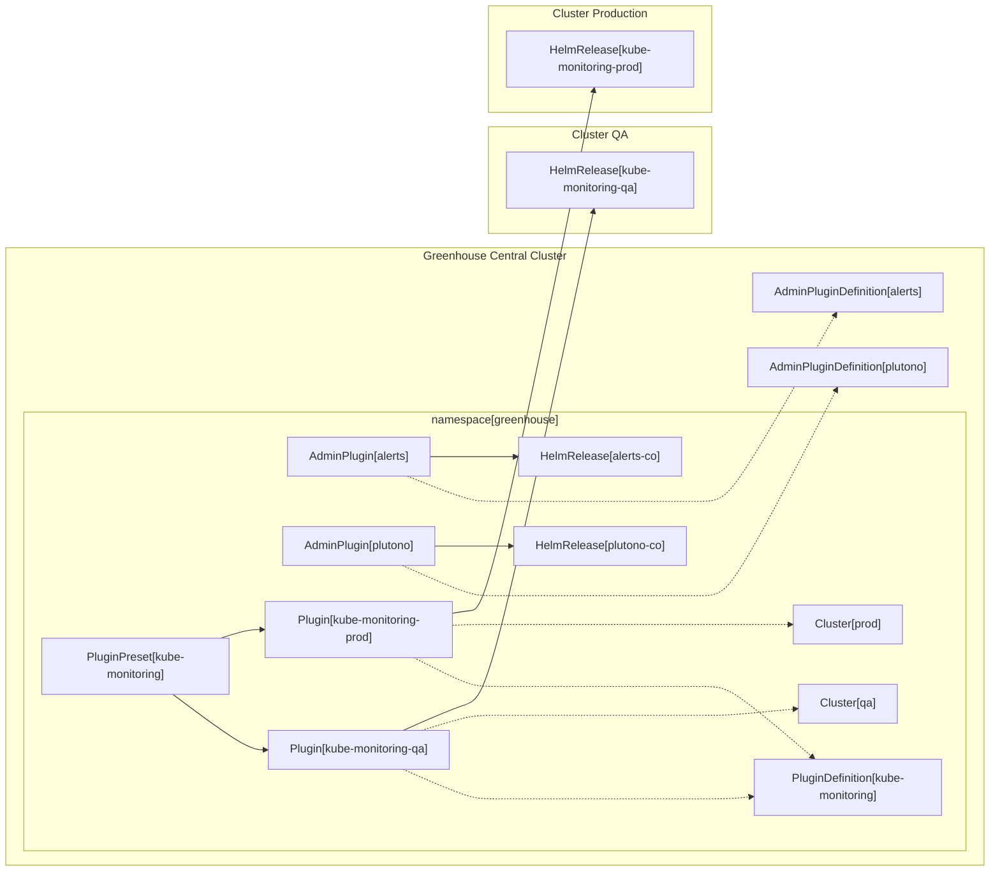

# 009-greenhouse-admin-plugin

- Status: proposed <!-- optional -->
- Deciders: Abhijith R., David G., Ivo G. <!-- optional -->
- Date: 18.12.2024 <!-- optional. To customize the ordering without relying on Git creation dates and filenames -->
- Tags: [greenhouse / cloudoperators] <!-- optional -->
- Technical Story: [description | ticket/issue URL] <!-- optional -->

## Context and Problem Statement

Within Greenhouse Plugins are used to deploy and configure operational tools. Some of these tools need to be run in the namespace of an Organization in the Central Cluster.
The list of Plugins that are allowed to be deployed into the Central Cluster should be limited. Only the administrators of the Greenhouse instance should be allowed to deploy any such Admin Plugins.
The configuration of these Plugins should be limited to ensure that the Organization cannot deploy Plugins that could negatively impact other tenants on the same cluster.

## Decision Drivers <!-- optional -->

- Stability:
  - Ensure that only approved Plugins are deployed into the Central Cluster
  - Ensure that only approved configurations are applied to the Plugins
- Simplicity:
  - It should be familiar for Admins to manage PluginDefinitions
- Enforced Compliance:
  - Ensure that the Organization cannot deploy Plugins that could negatively impact other tenants on the same cluster
- UI Integration:
  - UX for Admin and non-Admin PluginDefintions should be the same

## Considered Options

- PluginDefinition CRD with Admin flag
- AdminPluginDefinition & AdminPlugin

## Decision Outcome

Chosen option: "AdminPluginDefinition & AdminPlugin",
because it provides a dedicated CRD to use for Plugins designed to be used in the central cluster. This allows for more control over the allowed configuration without needing to have one controller that handles both cases. Together with the attached change of making the PluginDefinitions namespace scoped, this allows for more flexibility for the Organizations to bring their own Plugins while ensuring that AdminPlugins cannot break the central cluster.

### Positive Consequences <!-- optional -->

- explicit separation between Remote and Central Cluster Plugins, both in API and Controller code
- more control over the allowed configuration of AdminPlugins
- more flexibility for Organizations to bring their own Plugins

### Negative Consequences <!-- optional -->

- migration effort for existing Plugins deployed to the central cluster
- Dashboard needs to be updated to support AdminPluginDefinitions & AdminPlugins

## Pros and Cons of the Options | Evaluation of options <!-- optional -->

### PluginDefinition CRD with Admin flag

An additional field `deploymentScope` is added to a PluginDefinition. This field is an enum and defaults to `remote`. If set to `central`, the PluginDefinition is allowed to be deployed into the Central Cluster.
This allows with minimal changes to the existing PluginDefinition CRD to control which Plugins are allowed to be deployed into the Central Cluster. A PluginDefinition with the `deploymentScope` set to `all` is allowed to be deployed into remote clusters as well as into the Organization's Namespace in the Central Cluster.

A PluginDefinition with `deploymentScope` set to `central` must have limited configuration options. This is to ensure that the Plugin cannot be configured in a way that could negatively impact other tenants on the same cluster. That also means that only the PluginOptions defined on the PluginDefinition are allowed to be set. Any other configuration options are to be ignored.

| Decision Driver     | Rating | Reason                        |
|---------------------|--------|-------------------------------|
| Stability           | +++    | Good, because PluginDefinitions can be set as Admin    |                                                                                                                                                                                                                                                                | 
| Simplicity | +++    | Good, because for the Endusers the configuration is the same. |
| Enforced Compliance | o     | Neutral, because this depends on the underlying Helm Chart and the allowed PluginOptions. |
| UI Integration | ++      | Good, because the API objects are the same. |

### AdminPluginDefinition & AdminPlugin

Complete separation between Plugins that can be deployed into the Central Cluster and those that are deployed to remote clusters.

This gives more flexibility in the access control to these resources. This could mean that Plugins can be created by a wider audience than the AdminPlugins in the central cluster.

The CRD can be largely similar, but the underlying controller does not need to handle both cases (central & remote deployments). 
The split into two CRDs also allows to be more restrictive on the OptionValues to be set in the AdminPlugin. These can be limited to a well-defined defined in the AdminPluginDefinition. This will ensure that certain values such as container images or resource limits cannot be altered.

This also implies that UI applications are to be specified with an AdminPluginDefinitions. This will make it more explicit and intentional where the UI application will be running. In the case of the Plugin it is possible to deploy into a remote cluster, while the UI application is loaded in the central UI.

For some applications it also makes sense to only have one instance running per organization namespace. This can be enforced by having a dedicated field on the AdminPluginDefinition that specifies if it is a singleton.

As a side-effect of adding the cluster scoped AdminPluginDefinition, the existing PluginDefinitions can be migrated to be namespace scoped. This will allow the Organizations to bring their own PluginDefinitions more easily. Since the Plugins may only be deployed to remote clusters, the PluginDefinitions can be more permissive in the configuration options.

| Decision Driver     | Rating | Reason                        |
|---------------------|--------|-------------------------------|
| Stability           | o    |  Neutral, because the API is the same as for PluginDefinitions & Plugins with some restrictions. There is some migration effort required.   |                                                                                                                                                                                                                                                                | 
| Simplicity | ++/-    | Good, because the required controller will be simpler with shared functionality from the Helm Controller. But it requires migration of existing Plugins deployed to the central cluster. Negative, because the UI needs to support two different Kinds of Plugins, while they largely share the same API specifications. |
| Enforced Compliance | ++     | Good, because config can be enforced on the AdminPluginDefinition |
| UI Integration | o      | Neutral, because the API objects are largely the same. |

```yaml
apiVersion: greenhouse.sap/v1alpha1
kind: AdminPluginDefinition
metadata:
  name: alerts
spec:
  description: The Alerts Plugin consists of both Prometheus Alertmanager and Supernova,
    the holistic alert management UI
  displayName: Alerts
  docMarkDownUrl: https://raw.githubusercontent.com/cloudoperators/greenhouse-extensions/main/alerts/README.md
  helmChart:
    name: alerts
    repository: oci://ghcr.io/cloudoperators/greenhouse-extensions/charts
    version: 0.15.5
  icon: https://raw.githubusercontent.com/cloudoperators/greenhouse-extensions/main/alerts/logo.png
  options:
  - description: Alertmanager API Endpoint URL
    name: endpoint
    required: true
    type: string
  # skipped other options for brevity. Only the options defined here are allowed to be set on the AdminPlugin. Any other options are rejected. This is to ensure that the Plugin cannot be configured in a way that could negatively impact other tenants on the same cluster.
  uiApplication:
    name: supernova
    version: latest
  version: 2.3.5
  weight: 0

```


