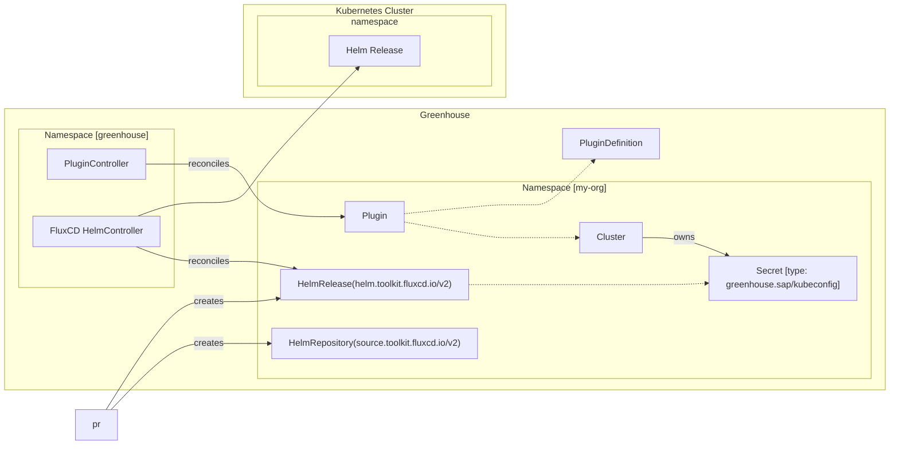

# 009-greenhouse-helm-controller-ng

- Status: [accepted] <!-- optional -->
- Deciders: [Abhijith R., David G., Ivo G.] <!-- optional -->
- Date: [2025-03-07] <!-- optional. To customize the ordering without relying on Git creation dates and filenames -->
- Tags: [greenhouse / cloudoperators] <!-- optional -->
- Technical Story: [plugins] <!-- optional -->

## Context and Problem Statement

Greenhouse uses [helm.sh](https://helm.sh/docs/) to deploy the Plugins to Kubernetes Clusters. The Helm lifecycle is implemented in the Helm Controller. The Helm Controller is a simple controller that deploys the Chart and rolls it back if it fails. It does not handle releases stuck in Pending, releases constantly failing, or rollback to previous versions.

There have been various occasions where this controller has not been able to handle the lifecycle of the Helm releases. This has led to manual intervention to fix the releases.

Examples of issues:

- Helm releases stuck in Pending
- Helm releases constantly failing
- Helm Charts always producing a new `helm diff` between two deployments
- Helm Charts not rolling back to the previous version, in case the initial install fails

There are two options to solve this problem:

1. Invest more development time into the existing Helm Controller to make it more robust and support all the above features.
2. Replace the Helm Controller with a more robust solution that can handle the above features.

## Decision Drivers <!-- optional -->

- Simplicity:
  - The solution should work without any end-user-facing changes.
- Control:
  - The solution should allow to control the lifecycle of the Helm releases.
- Stability:
  - The solution should be stable and reliable.
  - The lifecycle of the Helm releases should be handled correctly.
- Development cost:
  - Time spent on the development of the solution.

## Considered Options

- Helm Controller with more development time
- FluxCD Helm Operator
- ArgoCD

## Decision Outcome

Chosen option: "FluxCD Helm Operator",
because the migration from the current Helm controller to Helm releases by Flux can be done seamlessly. The CRDs of Flux support the same features as the Plugin and PluginDefinition CRDs. With the additional benefit that FluxCD can be run in a Hub-Spoke model, where a central FluxCD instance inside the Greenhouse cluster can manage multiple clusters.
The development cost is expected to be less than the continued development of the Helm Controller. This is due to the fact that the FluxCD Helm Operator is a proven solution that is widely adopted in the CNCF landscape. There will be continuous effort to operate the Flux deployment but this would also be the case for the Helm Controller.

### Positive Consequences <!-- optional -->

- Close to a drop-in replacement for the current Helm Controller
- Proven solution that is widely adopted in the CNCF landscape
- Community support
- No changes for the end user

### Negative Consequences <!-- optional -->

- Continuous effort to operate the Flux deployment
- Initial effort to implement a new controller, that translates from Greenhouse CRDs into Flux CRDs
- Initial effort to onboard the team with FluxCD

### Helm Controller with more development time

The Helm controller supports the basic lifecycle around Helm actions. The Helm actions such as `install`, `upgrade`, `delete`, `rollback`, `diff` are already provided by upstream Helm. This means the controller manages the install, upgrade, and delete of a Plugin's Helm releases. Furthermore, it can diff the Helm release and roll back in case the previous upgrade fails.

Currently there is a list of features that is not supported:

- handling releases stuck with a pending status
- releases constantly failing (exponential backoff, but no circuit breaker/ limit of retries)
- rollback to previous versions on-demand
- circuit breaker for releases that constantly create a new diff
- ... anything else that we might need in the future

| Decision Driver     | Rating | Reason                        |
|---------------------|--------|-------------------------------|
| Simplicity | +++    | Good, because virtually no changes for the end user.    |                                                                                                                                                                                                                                                                | 
| Control | ++    | Good, because we have the whole source code, besides upstream helm, under our control.    |
| Stability | o     | Neutral, because the current state of the controller is lacking some key features. We only have limited time and a limited amount of hands to keep working on the Helm Controller.     |
| Development cost | --      | Negative, because there are a multitude of features missing to make the controller work reliable and to support the full plugin lifecycle. |

### FluxCD Helm Operator

[FluxCD](https://github.com/fluxcd/flux2) provides a suite of controllers around the lifecycle of Helm Releases. These controllers are proven to be stable and reliable.

In order to replace the HelmController which Greenhouse uses, it is necessary to create Flux CRDs from the Plugin. This can be done by implementing a new controller that works with the Plugin CRDs.

The flow for the interaction between the Greenhouse and the FluxCD Helm Operator can look as follows:

There are no end-user-facing changes. All the data required by the FluxCD Helm Operator is already present in the Plugin, PluginDefinition and Cluster CRDs.
The Flux resources in the org namespace can even be hidden from the end user, as they should be managed only by Greenhouse. The end user should only see the status of Flux's HelmRelease resource reflected in the Plugin's status.

| Decision Driver     | Rating | Reason                        |
|---------------------|--------|-------------------------------|
| Simplicity | +++    | Good, because there are no changes for the end user.    |                                                                                                                                                                                                                                                                | 
| Control | -    | Negative, while FluxCD is open source there is no guarantee to have a proposed feature request or a bug fix merged. |
| Stability | +++     | Good, because this is a proven solution that is widely adopted in the CNCF landscape.     |
| Development cost |   o/-   | Neutral/Negative, because there is a development effort to implement the controller that translates from Greenhouse CRDs into Flux CRDs. A benefit is that the Flux CRDs map with the current features of the Plugin & PluginDefinition CRDs. Also the Status must be reliably transferred back to the Plugin. Other existing controllers (HelmTest, WorkloadStatus) may need to be adjusted. Another factor is the operations of the Flux controller(s) which is a continuous effort. |

### ArgoCD

ArgoCD is a GitOps continuous delivery tool for Kubernetes. It follows the GitOps pattern of using Git repositories as the source of truth for defining the desired application state. It also supports Helm Charts as the source for Kubernetes Manifests but does not use Helm directly. All manifests are rendered and managed by ArgoCD itself. This means there are no Helm releases in the Kubernetes cluster.

It also supports a Hub-Spoke model where one ArgoCD instance can manage multiple clusters. Furthermore, there are CRDs available to specify the desired state of the application. Secrets cannot be referenced easily from Kubernetes Secrets.

Helm Charts that automatically generate values such as passwords or certificates do not work well out of the box with ArgoCD. The problem is that Argo will template the Helm Chart every time and compare with the deployed resources. This will always result in a diff. Therefore, it is necessary to adjust the values in such a way that they are stable between multiple executions of helm templates.

| Decision Driver     | Rating | Reason                        |
|---------------------|--------|-------------------------------|
| Simplicity | -  | Negative, because it requires reworking of how the Helm Charts are configured. Helm Charts with generated values need to be adjusted.    |                                                                                                                                                                                                                                                                |
| Control | -    | Negative, while ArgoCD is open-source there is no guarantee to have a proposed feature request or a bug fix merged.    |
| Stability |	+++	| Good, because this is a proven solution that is widely adopted in the CNCF landscape. |
| Development cost | --  | Negative, the CRDs from ArgoCD do not map directly to what the Plugins specify for the release. Currently the Plugins are strongly tied with Helm releases, Argo manages the resources without Helm. |

## Related Decision Records <!-- optional -->

None.

## Links <!-- optional -->
