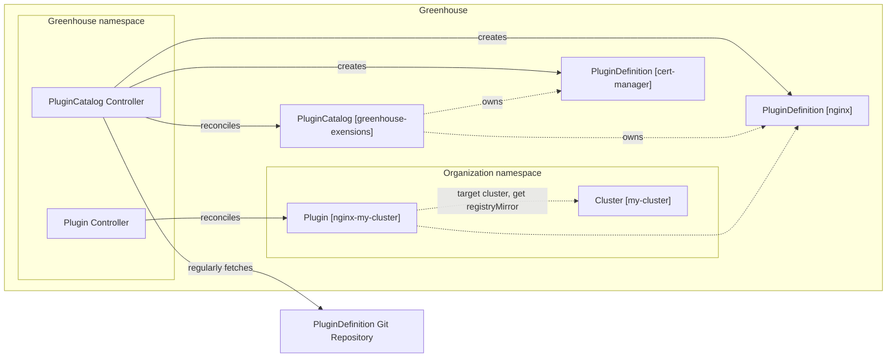
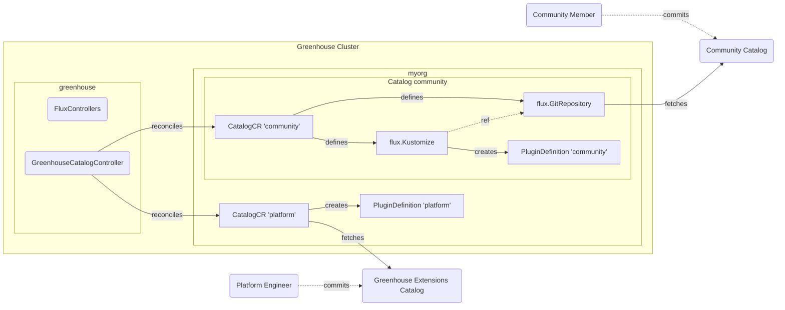

# 010-greenhouse-plugin-catalog

- Status: [accepted] <!-- optional -->
- Deciders:  Abhi, Akshay, David, Ivo, Martin, Uwe, Richard
- Date: [2025-03-07] <!-- optional. To customize the ordering without relying on Git creation dates and filenames -->
- Tags: [greenhouse] <!-- optional -->

## Context and Problem Statement

PluginDefinitions are a core component of Greenhouse. They are used to extend the platform and to deploy content to the remote clusters. Currently, the deployment of these PluginDefinitions into Greenhouse is not natively integrated. There is no provided mechanism to deploy and update PluginDefinitions for Greenhouse. This has to be setup by each team operating a Greenhouse instance. PluginDefinitions are used in the Greenhouse Helm Chart itself, this leads to a bootstrapping problem on the first install.

This ADR addresses the mentioned problems and proposes a solution to natively integrate the deployment of PluginDefinitions into Greenhouse. This will allow to easily add additional sources for PluginDefinitions and to manage them in a more structured way.

## Decision Drivers <!-- optional -->

- Native integration of PluginDefinitions
  - no external tools required to deploy PluginDefinitions
- Control over deployed PluginDefinitions
  - Greenhouse admin team manages the PluginDefinitions
  - Version pinning of PluginDefinitions
- Security & Compliance
  - Ensure that PluginDefinitions are secure and up-to-date
  - Ensure that PluginDefinitions are deployed from a trusted source
  - Allow to specify registry mirrors for PluginDefinitions artificats (e.g. OCI Images)

## Considered Options

- Cluster-scoped PluginCatalog CRD with cluster-scoped PluginDefinitions
- Namespaced-scoped PluginDefinitionCatalog CRD that configures Flux to manage a git repository of PluginDefinitions

## Decision Outcome

Chosen option: "Namespaced-scoped PluginDefinitionCatalog CRD that configures Flux to manage a git repository of PluginDefinitions",
because this options provides the most flexibility and covers the current requirements. It allows both the Greenhouse admin team and the individual organizations to easily add and update PluginDefinitions.
Making the PluginDefinition a namespace-scoped resource also removes the need for central management and approval of Plugins. The Catalog is now in the responsibility of the individual organizations.
The first iteration will allow to sync PluginDefinitions from a git repository. Under the hood this will be configured with FluxCD resources.

There will be a default catalog provisioned for each Organization that includes the PluginDefinitions from the Greenhouse Extensions repository. This catalog is managed by the controller and will be updated automatically.
For Community Catalogs there will be a template repository provided, with a set of Github Actions to make the development of PluginDefinitions easier.

The difference between Greenhouse Extensions and Community catalogs is that the Greenhouse Extensions catalog should provide the tools to manage and operate infrastructure components. The PluginDefinitions in a community catalog are more focused on the individual needs of the organization. This includes but is not limited to specific UI Applications, operations bundles (metric exporter, Prometheus rules, Perses dashboards etc.) or other tools that are either domain specific or even internal.

### Positive Consequences <!-- optional -->

- The bootstrapping problem on the first install of Greenhouse is improved, now that PluginDefinitions are managed by a CRD, they can be deployed without additional steps.
- Moving the PluginDefinitions to a namespace-scoped resource allows the individual organizations to manage their own PluginDefinitions.
- The solution is based on FluxCD, which is already used in Greenhouse to deploy the Helm Releases of Plugins. This reduces the complexity of the implementation.
- The Greenhouse admin team can ensure that updates to the Greenhouse extensions catalog are deployed in a timely manner and that the PluginDefinitions are secure and up-to-date.

### Negative Consequences <!-- optional -->

- The Greenhouse admin team has less control over the PluginDefinitions that can be deployed into a remote cluster. This is now in the responsibility of the individual organizations.

## Pros and Cons of the Options | Evaluation of options <!-- optional -->

### Cluster-scoped PluginCatalog CRD with cluster-scoped PluginDefinitions

The PluginCatalog CRD is a cluster-scoped resource that allows the Greenhouse admin team to control the available PluginDefinitions and their versions. This ensures an Organization cannot add PluginDefinitions to the Greenhouse cluster, that could negatively impact other tenants on the same cluster. Also this ensures that the Greenhouse team can control the PluginDefinitions and their versions that are available to the Organizations.

Having a dedicated PluginCatalog CRD allows to integrate the deployment of PluginDefinitions into the platform and removes the need for a separate deployment mechanism. 
A centrally managed PluginCatalog also allows to specify registry mirrors to be used. This allows to default registries specified inside the PluginDefinitions to a registry mirror. This ensures that the Images used in a Plugin use a trusted registry.
In order to support this, the PluginOptions are extended to an additonal type that is a `registry`. This type allows to flag a value specified on the Helm release to be a registry. This value can then be overridden/defaulted directly on the Plugin.

This requires a couple of changes on the PluginDefinition and Cluster CRDs:

```yaml
apiVersion: greenhouse.sap/v1alpha1
kind: PluginDefinition
metadata:
  name: qa-values
spec:
  options:
    - name: 'fluent-bit.image.registry'
      default: 'ghcr.io/cloudoperators/greenhouse'
      type: 'registry'
      required: true

---

apiVersion: greenhouse.sap/v1alpha1
kind: Cluster
metadata:
  name: my-cluster
spec:
  accessMode: "direct"
  registryMirrors:
    - origin: "ghcr.io/cloudoperators/greenhouse"
      mirror: "my-registry.cloud/mirror/greenhouse"
```

The PluginCatalog CRD supports specifying the source of the PluginDefinitions. This can intially be a git repository. The PluginCatalog controller will regularly fetch the PluginDefinitions from the repository and update the PluginDefinition resources in the Greenhouse cluster. The PluginCatalog controller will also ensure that the PluginDefinitions are versioned and that the PluginDefinitions are not updated if the version is pinned.

```yaml
apiVersion: greenhouse.sap/v1alpha1
kind: PluginCatalog
metadata:
  name: greenhouse-core
  namespace: my-organization
spec:
  source:
    git:
      repository: https://github.com/cloudoperators/greenhouse-extensions/
      ref:
        branch: main # tag: v0.1.0 , commit: 123456
  interval: 5m
```



In order to ensure that the repository for the PluginDefinitions is secure and up-to-date, there will be a template repository provided. This template repository includes GitHub actions to perform linting, testing, and building of the Helm Charts used in the PluginDefinitions. For external Helm Charts actions are configured to automatically open a pull request if there are updates available.

Summarizing the PluginCatalog CRD allows to manage the update of PluginDefinitions in a structured way. The catalog is managed by the Greenhouse admin team and any additional PluginDefinitions and version upgrades must be approved by this team. The PluginCatalog controller ensures that the version of the Plugin currently running in the cluster is not automatically updated if the version is pinned. Both the PluginCatalog and the PluginDefinition CRDs are cluster-scoped resources being managed by the Greenhouse admin

| Decision Driver     | Rating | Reason                        |
|---------------------|--------|-------------------------------|
| Native integration of PluginDefinitions | +++    | Good, because there is a dedicated API and a custom controller to reconcile the PluginDefinitionCatalog. In case that there are specific requirements, they can be added to the controller.    |                                                                                                                                                                                                                                                                | 
| Control over deployed PluginDefinitions | o    | Neutral, because the Greenhouse admin team has great control over which PluginDefinition may be created in the cluster. However, the individual organizations are dependent on the admin team to add their additional PluginDefinitions to a PluginDefinitionCatalog or to change their PluginDefinitionCatalog. |
| Security & Compliance | +++  | Good, because the Greenhouse admin team can ensure updates of the PluginDefinitions are deployed in a timely manner.  |

### Namespaced-scoped PluginDefinitionCatalog CRD that configures Flux to manage a git repository of PluginDefinitions

In contrast to the first option this will introduce a namespaced-scope PluginDefinitionCatalog. This resource will be the Greenhouse-native way to bring PluginDefinitions into the Platform. The proposed first iteration will allow to sync PluginDefinitions from a git repository.

In order to follow Kubernetes conventions, the PluginDefinitions need to move from the cluster-scope to the namespace-scope. This ensures that there are no namespaced resources that are managing resources on the cluster scope. Furthermore, this brings more flexibility to the individual organizations.
It allows them to easily bring their own PluginDefinitions without having additional approval of the admin team. However, the PluginDefinitions that are allowed to be deployed into the cluster are still managed by the Greenhouse team. This is to ensuret that only approved PluginDefinitions can be deployed, which should largely be UI Applications.
The catalog of PluginDefinitions defined in [greenhouse-extensions](https://github.com/cloudoperators/greenhouse-extensions) would be automatically provisioned for each Organization. This is to ensure that they have the curated set of PluginDefinitions readily available.

Each individual catalog should be easily defined by pointing to a git repository and optionally providing credentials for private repositories etc..

By default the Catalog will point to a branch or ref of the git repository. In an interval the source repository will be checked and on a Change the `kustomize.yaml` will be invoked.

The Git repository should therefore follow the convention of having a `kustomize.yaml` in the root of the project, which is pointing to the individual PluginDefinitions.

```yaml
# example git repository for a Catalog
- root
    - kustomize.yaml
    - pluginDefinition1
        - pluginDefinition.yaml
        - chart
    - pluginDefinition2
        - pluginDefinition.yaml
        - chart
```

The development of new Plugins and the testing of Updates need to be considered as well. Developing and consuming Plugins in the same Greenhouse organization can be possible by using pre release versions for the PluginDefinitions. [example](https://go.dev/play/p/3dsk1B-e8B-)
This will allow in Combination with the PluginDefinitionRevision ADR to pin a Plugin/PluginPreset to a `1.0.1-rc.1` to test out a new feature or updates. Automatic updates of PluginPresets should ignore these versions.
How these version should be deployed to the cluster can be left to the respective maintainer of the catalog. An incomplete list includes:

- Catalog that points to a `dev` branch where development versions of a PluginDefiniton are merged into
- Enhancing the `kustomize.yaml` and pointing to an additional `plugindefintion-dev.yaml` that includes the pre-release configuration of a PluginDefinition

```yaml
apiVersion: greenhouse.sap/v1alpha1
kind: PluginDefinitionCatalog
metadata:
  name: greenhouse-core
  namespace: my-organization
spec:
  source:
    git:
      repository: https://github.com/cloudoperators/greenhouse-extensions/
      ref:
        branch: main # tag: v0.1.0 , commit: 123456
      interval: 5m
  deletionPolicy:
      maxRevisions: 5
      ...
```



One potential issue with this method in combination with the proposed PluginDefinitionRevisions is the garbage collection of old revisions. On the one hand revisions should be purged eventually, on the other hand revisions in use should not be deleted to prevent any interruptions.

A pragmatic approach would be to define a maximum number of revisions. Then an asynchronous job can periodically check for PluginDefinitions if there are more than the maximum number of revisions. In this case it should delete the smallest semantic version first, but only if it is no longer in use.
This will eventually lead to older revisions being purged from the namespace.

Another option would be to force upgrades, but this will cause problems with the declarative approach of Greenhouse. Just upgrading as soon as there are more than max revisions could also lead to unintended side effects.

Summarizing, both the PluginDefinitionCatalog and the PluginDefinitions will be made namespace-scoped resources. This gives the individual organizations more flexibility to manage their own PluginDefinitions. The backend of the PluginDefinitionCatalog will be largely handled by Flux, which reduces the complexity of the implementation. It is ensured the PluginDefinitions of the Greenhouse Extensions are available to all Organizations by default and that the Organziation may only deploy additional UI PluginDefinitions into the Greenhouse cluster.

| Decision Driver     | Rating | Reason                        |
|---------------------|--------|-------------------------------|
| Native integration of PluginDefinitions | ++    | Good, because there is a dedicated API and a custom controller to reconcile the PluginDefinitionCatalog. Since Flux has been chosen to deploy the Helm Releases of Plugins, there is the option to use it as well to manage the PluginDefinitionCatalog. This means there is no additional implementation effort for the backend of the catalog. |                                                                                                                                                                                                                                                                | 
| Control over deployed PluginDefinitions | o    | Neutral, because the Greenhouse admin team has great control over the upstream repository hosting the PluginDefinitions. Also the selection of PluginDefinitions allowed in the central cluster is limited. However, the individual organizations are free to add additional PluginDefinitions. Depending on the final implementation the provisioned Catalog with the Greenhouse extensions may be fully under the Organizations control.|
| Security & Compliance | o    | Neutral, because the Greenhouse admin team has great control over the upstream repository hosting the PluginDefinitions. However, the individual organizations are free to add additional PluginDefinitions. This means it is in the Organizations responsibility to update. In the future any compliance issues with the Helm Releases of a Plugin will be made visible to the Organization  |

## Related Decision Records <!-- optional -->

- [ADR-009: Helm Controller](./009-greenhouse-helm-controller-ng.md): This ADR decided to introduce Flux as a replacement for the HelmController. Flux will also be used as the backend for the Catalog.
- [ADR-011: Plugin Lifecycle](./011-greenhouse-plugin-lifecycle.md): This ADR will define the lifecycle of a Plugin and builds on top of the PluginDefinitionCatalog.

## Links <!-- optional -->

- [Link type](link to adr) <!-- example: Refined by [xxx](yyyymmdd-xxx.md) -->
- … <!-- numbers of links can vary -->
