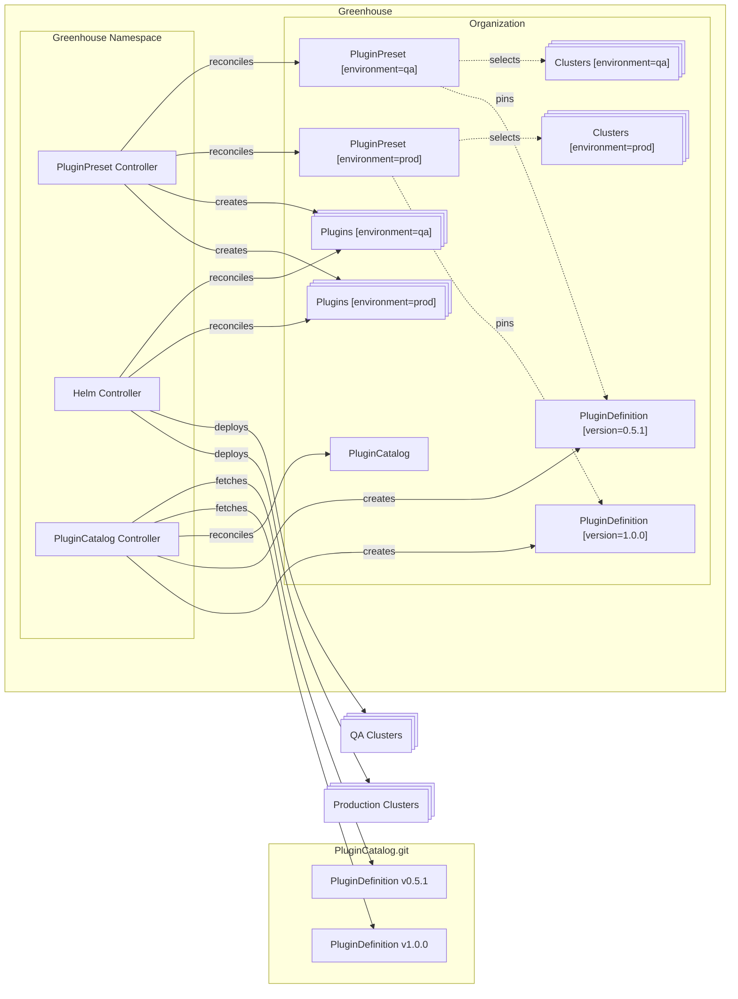

# 013-greenhouse-plugin-lifecycle

- Status: [draft] <!-- optional -->
- Deciders: [Arno, Ivo, Uwe, David] <!-- optional -->
- Date: [YYYY-MM-DD when the decision was last updated] <!-- optional. To customize the ordering without relying on Git creation dates and filenames -->
- Tags: [greenhouse / cloudoperators] <!-- optional -->
- Technical Story: [description | ticket/issue URL] <!-- optional -->

## Context and Problem Statement

Greenhouse uses Plugins to provide cluster administrators with the ability to deploy and manage operations tooling on their Kubernetes clusters.
PluginDefinitions define the Helm Chart and it's default settings. A Plugin is a particular configuration of a PluginDefinition, which can set additional settings and targets a specific cluster.

The PluginDefinition is a cluster-scoped resource. That means, a PluginDefinition is available for all Organizations in the same Greenhouse instance. An update to a PluginDefinition will affect all Organizations and using this PluginDefinition.
The current mechanism updates all Plugins in all Organizations instantly. This is a risk, as a faulty PluginDefinition update can break all clusters using this PluginDefinition.
Also there is no option to pin the used PluginDefinition version for a Plugin.

In order to mitigate this risk, there are E2E and plugin-specific tests in place. However, these tests are not sufficient to prevent all possible issues.

The goal of this ADR is to define a concept that allows:

- to stage the rollout of new PluginDefinition versions
- to allow pinning of PluginDefinition versions for Plugins
- to allow multiple versions of a PluginDefinition to be available in a Cluster
- to provide more insights into the PluginDefinition changes to the customer
  - Changelog for the PluginDefinition?
  - Migration tasks for the PluginDefinition?
  - Helm Diff for the Plugin?
- Introduce a concept of tiers for clusters, to stage rollouts of Plugins
- Introduce a Plugin Lifecycle Policy
- There must be a way to handle breaking changes due to Plugin updates

**Discussion:**

- Plugin on the greenhouse-extensions.git main branch must be production ready
- Get inspiration from Gardener to inform customer "Upcoming changes in plugin ..." with a grace period and let him update for testing. Force upgrade afterwards.
- Classify cluster
- Stable API with migration paths
- Follow engineering policy: Bronze, Silver, Gold with grace period in between.
- Configurable terms for stages; configurable time between stages with greenhouse-enforced maximum.
- Emergency fixes should be possible
- How to handle failed upgrades: rollback vs forward fix (tendency: forward fix)

## Decision Drivers <!-- optional -->

- Multiple versions of a PluginDefinition
- Pinning of PluginDefinition versions for Plugins
- Rollback on Failure
- Staged Rollouts
- Reporting of Plugin changes to the customer

## Considered Options

- Argo Rollouts (Not viable ❌)
- PluginPreset as the Orchestrator for Plugins
- FluxCD
- [option 4]
- … <!-- numbers of options can vary -->

## Decision Outcome

Chosen option: "[option 1]",
because [justification. e.g., only option, which meets k.o. criterion decision driver | which resolves force force | … | comes out best (see below)].

### Positive Consequences <!-- optional -->

- [e.g., improvement of quality attribute satisfaction, follow-up decisions required, …]
- …

### Negative Consequences <!-- optional -->

- [e.g., compromising quality attribute, follow-up decisions required, …]
- …

## Pros and Cons of the Options | Evaluation of options <!-- optional -->

### Argo Rollouts (Not viable ❌)

Description: A Kubernetes controller and set of CRDs for advanced deployment capabilities including canary deployments, blue-green deployments, and progressive delivery features.

| Decision Driver           | Rating | Reason                                                                                           |
|--------------------------|--------|--------------------------------------------------------------------------------------------------|
| Multi-cluster Management | ---    | Cannot manage rollouts from central cluster; requires controller in every remote cluster          |
| Operational Complexity   | --     | High complexity due to required installation in each cluster                                      |
| Integration Capabilities | +      | Good integration with Kubernetes workloads but requires significant architecture changes          |
| Flexibility             | +++    | Excellent support for various deployment strategies                                               |
| Monitoring              | +++    | Strong metrics-based analysis and verification                                                    |

Key Limitation: Argo Rollouts cannot be used in a centralized manner. [As per their documentation](https://argoproj.github.io/argo-rollouts/FAQ/#can-we-install-argo-rollouts-centrally-in-a-cluster-and-manage-rollout-resources-in-external-clusters), the Rollout controller and CRDs must be installed in every target cluster where progressive delivery is needed. This architectural limitation makes it unsuitable for our centralized plugin management approach, as it would:

1. Significantly increase operational overhead by requiring installation and management in every target cluster
2. Complicate our existing centralized plugin management architecture using the plugin controller
3. Add unnecessary complexity to the current plugin controller's responsibilities
Due to these limitations, especially the inability to manage rollouts from a central cluster, this option is not viable for our use case.

### PluginPreset as the Orchestrator for Plugins

Description: The existing PluginPreset CRD already manages part of the Lifecycle for Plugins. Currently it allows to configure Plugins for multiple clusters. If the PluginPreset is extended to manage the PluginDefinition versions, then it can be used to orchestrate the Plugin Lifecycle.

In this approach, the PluginPreset would be extended to allow the following:

- Plugin is extended to include the PluginDefinition version to be used
- Value defaulting is done by the PluginPreset
- If a PluginDefinition requires additional required values, the PluginPreset will stop the Plugin from being updated
- PluginPreset will need an aggregated status of all managed Plugins
- UI only shows PluginPreset, not Plugin

The PluginPreset already allow to target a set of clusters by labelSelector. The used label can be used to classify the clusters into different tiers.

By adding additional validation on the PluginPreset level, the PluginPreset can be used to stop upgrades of Plugins, if the PluginDefinition requires additional values.

By allowing the user to only edit the PluginPreset, there is no need to ensure the user makes invalid changes to the Plugin.

It is very important that the PluginDefinitions and the used Helm Charts are sufficiently tested before they are merged and released. There also needs to be extra validation in the PR to ensure that the PluginDefinition is not changed in a way that breaks between minor versions. Additional required values must only be added or removed in a major version. This is to ensure that the PluginPreset can be used to stop the Plugin from being updated, before the OptionValues are fixed.

| Decision Driver     | Rating | Reason                        |
|---------------------|--------|-------------------------------|
| [decision driver a] | +++    | Good, because [argument a]    |                                                                                                                                                                                                                                                                | 
| [decision driver b] | ---    | Good, because [argument b]    |
| [decision driver c] | --     | Bad, because [argument c]     |
| [decision driver d] | o      | Neutral, because [argument d] |

### [PluginPreset as Orchestrator with support for Breaking changes / update opt-in/out]

[example | description | pointer to more information | …] <!-- optional -->

Description: Like PlugionPreset Orchestrator idea above with more features for the sake of customer happiness.

#### Breaking changes
There needs to be a flag or sth to block a plugin rollout automatically from master, if a breaking change is introduced.

In case there are blockers for rolling out automatically there need to be a blocker flag / label which will prohibit the rollout of newer versions to customer clusters.

Customers need to made aware that an update is pending (notification via UI (alert bell?)/Slack) and that they have to actively migrate.

* Introduce a timer counting backwards in the UI
* Introdcue alerts
    * we need to export this as a metric if there are pending updates

#### Update windows

Customers will usually rarely update and the amount of different plugin versions should be rather minimal. However the updates should never be rolled out without the customer being aware of it. 

Idea: introduce update windows which are mandatory to set either globally or on a per plugin base. Could be in a cronjob style manner. The Controller will only attempt to update Plugins during given window.
Maybe only offer to set the time window to a day of week/time to have the possibility of updating at least weekly.

| Decision Driver     | Rating | Reason                        |
|---------------------|--------|-------------------------------|
| [decision driver a] | +++    | Good, because [argument a]    |                                                                                                                                                                                                                                                                | 
| [decision driver b] | ---    | Good, because [argument b]    |
| [decision driver c] | --     | Bad, because [argument c]     |
| [decision driver d] | o      | Neutral, because [argument d] |

### Flux

This is a tool that can orchestrate resources from a central plane. It does not require any CRDs in remote planes, it integrates nicely with amongst others Helm and Kustomise. Using the tool [Flagger.app](https://flagger.app), various deployment strategies can be utilised.

|
 Decision Driver 
    | Rating | Reason |
|---------------------|--------|-------------------------------|
| Multi-tenancy (Admin-remote cluster management) | +++ | This tool is natievly supporting [multi-tenancy](https://fluxcd.io/flux/installation/configuration/multitenancy/). |
| HelmRelease trigger  | ++ | FluxCD [can fetch and listen](https://fluxcd.io/flux/components/helm/) for new Helm releases and automatically roll-them out. |
| GitOps support | + | Rolling out with e.g. Github Actions is [possible](https://fluxcd.io/flux/use-cases/gh-actions-helm-promotion/). |
| No CRDs in remote-clusters | ++ | [At a brief glance](https://fluxcd.io/flux/installation/configuration/multitenancy/), FluxCD [seems](https://github.com/fluxcd/flux2-hub-spoke-example) to not require CRDs/resources in remote-clusters for Helm related installs only the admin-cluster requires CRDs e.g. the so-called 'HelmRelease'. However, it is not clear whether Flagger or with e.g. Kustomize requires CRDs in remote-clusters. |
| Deployment strategies (Flagger) | + | [Docs](https://docs.flagger.app/install/flagger-install-with-flux) |
| Scope in restructuring the roll-out | -- | To integrate Flux properly, and possibly Flagger, there will be an overhead in restructuring the logic. |
| Added complexity | -- | This tool would bring additional complexity (in the sense of integration efforts, dependency managment, customisation etc) to our landscape.† |
| Kustomize roll-out of PluginDefintions | ? | Using Kustomize to roll-out PluginDef updates could control version updates on PluginDefs. Could require some refactoring and introduce complexity in the Plugin authoring. |

> † The task of a controlled and high-quality roll-out managment is arguably a complex task, so this might be unavoidable.

### [option 4]

[example | description | pointer to more information | …] <!-- optional -->

| Decision Driver     | Rating | Reason                        |
|---------------------|--------|-------------------------------|
| [decision driver a] | +++    | Good, because [argument a]    |                                                                                                                                                                                                                                                                | 
| [decision driver b] | ---    | Good, because [argument b]    |
| [decision driver c] | --     | Bad, because [argument c]     |
| [decision driver d] | o      | Neutral, because [argument d] |

## Related Decision Records <!-- optional -->

[previous decision record, e.g., an ADR, which is solved by this one | next decision record, e.g., an ADR, which solves this one | … | pointer to more information]

## Links <!-- optional -->

- [Link type](link to adr) <!-- example: Refined by [xxx](yyyymmdd-xxx.md) -->
- … <!-- numbers of links can vary -->
