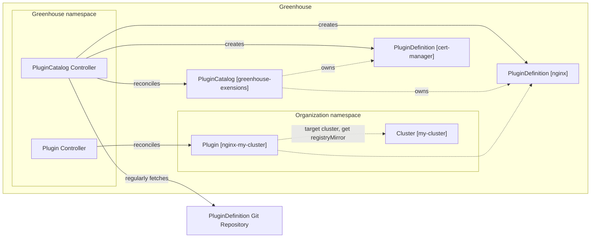

# 014-greenhouse-plugin-catalog

- Status: [draft] <!-- optional -->
- Deciders: [list everyone involved in the decision] <!-- optional -->
- Date: [YYYY-MM-DD when the decision was last updated] <!-- optional. To customize the ordering without relying on Git creation dates and filenames -->
- Tags: [greenhouse] <!-- optional -->
- Technical Story: [description | ticket/issue URL] <!-- optional -->

## Context and Problem Statement

PluginDefinitions are a core component of Greenhouse. They are used to extend the platform and to deploy content to the managed clusters. Currently, the deployment of these PluginDefinitions is not natively integrated into Greenhouse. This requires a separate deployment mechanism to be configured. Since the PluginDefinitions are used by the Greenhouse deployment itself, there is also a bootstrapping problem.

This ADR addresses this problem and proposes a solution to natively integrate the deployment of PluginDefinitions into Greenhouse. This will allow to easily add additional sources for PluginDefinitions and to manage them in a more structured way.

## Decision Drivers <!-- optional -->

- Native integration of PluginDefinitions
  - no external tools required to deploy PluginDefinitions
- Control over deployed PluginDefinitions
  - Greenhouse admin team manages the PluginDefinitions
  - Version pinning of PluginDefinitions
- Security & Compliance
  - Ensure that PluginDefinitions are secure and up-to-date
  - Ensure that PluginDefinitions are deployed from a trusted source
  - Allow to specify registry mirrors for PluginDefinitions artificats (e.g. OCI Images)

## Considered Options

- PluginCatalog CRD to manage a repository of PluginDefinitions
- [option 2]
- [option 3]
- … <!-- numbers of options can vary -->

## Decision Outcome

Chosen option: "[option 1]",
because [justification. e.g., only option, which meets k.o. criterion decision driver | which resolves force force | … | comes out best (see below)].

### Positive Consequences <!-- optional -->

- [e.g., improvement of quality attribute satisfaction, follow-up decisions required, …]
- …

### Negative Consequences <!-- optional -->

- [e.g., compromising quality attribute, follow-up decisions required, …]
- …

## Pros and Cons of the Options | Evaluation of options <!-- optional -->

### PluginCatalog CRD with PluginDefinitions

The PluginCatalog CRD is a cluster-scoped resource that allows the Greenhouse admin team to control the available PluginDefinitions and their versions. This ensures Organization cannot add PluginDefinitions to the Greenhouse cluster,that could negatively impact other tenants on the same cluster.

Having a dedicated PluginCatalog CRD allows to integrate the deployment of PluginDefinitions into the platform and removes the need for a separate deployment mechanism.
A centrally managed PluginCatalog also allows to specify registry mirrors to be used. This allows to default registries specified inside the PluginDefinitions to a registry mirror.
In order to easily support this, the PluginOptions are extended to an additonal type that is a `registry`. This type allows to flag a value specified on the Helm release to be a registry. This value can then be overridden/defaulted directly on the Plugin.

This requires a couple of changes on the PluginDefinition and Cluster CRDs:

```yaml
apiVersion: greenhouse.sap/v1alpha1
kind: PluginDefinition
metadata:
  name: qa-values
spec:
  options:
    - name: 'fluent-bit.image.registry'
      default: 'ghcr.io/cloudoperators/greenhouse'
      type: 'registry'
      required: true

---

apiVersion: greenhouse.sap/v1alpha1
kind: Cluster
metadata:
  name: my-cluster
spec:
  accessMode: "direct"
  registryMirrors:
    - origin: "ghcr.io/cloudoperators/greenhouse"
      mirror: "my-registry.cloud/mirror/greenhouse"
```

The PluginCatalog CRD supports specifying the source of the PluginDefinitions. This can intially be a git repository. The PluginCatalog controller will regularly fetch the PluginDefinitions from the repository and update the PluginDefinition resources in the Greenhouse cluster. The PluginCatalog controller will also ensure that the PluginDefinitions are versioned and that the PluginDefinitions are not updated if the version is pinned.

```yaml
apiVersion: greenhouse.sap/v1alpha1
kind: PluginCatalog
metadata:
  name: greenhouse-core
  namespace: my-organization
spec:
  source:
    git:
      repository: https://github.com/cloudoperators/greenhouse-extensions/
      ref:
        branch: main # tag: v0.1.0 , commit: 123456
  interval: 5m
```



In order to ensure that the repository for the PluginDefinitions is secure and up-to-date, there will be a template repository provided. This template repository includes GitHub actions to perform linting, testing, and building of the Helm Charts used in the PluginDefinitions. For external Helm Charts actions are configured to automatically open a pull request if there are updates available.

| Decision Driver     | Rating | Reason                        |
|---------------------|--------|-------------------------------|
| [decision driver a] | +++    | Good, because [argument a]    |                                                                                                                                                                                                                                                                | 
| [decision driver b] | ---    | Good, because [argument b]    |
| [decision driver c] | --     | Bad, because [argument c]     |
| [decision driver d] | o      | Neutral, because [argument d] |

### [option 2]

[example | description | pointer to more information | …] <!-- optional -->

| Decision Driver     | Rating | Reason                        |
|---------------------|--------|-------------------------------|
| [decision driver a] | +++    | Good, because [argument a]    |                                                                                                                                                                                                                                                                | 
| [decision driver b] | ---    | Good, because [argument b]    |
| [decision driver c] | --     | Bad, because [argument c]     |
| [decision driver d] | o      | Neutral, because [argument d] |

### [option 3]

[example | description | pointer to more information | …] <!-- optional -->

| Decision Driver     | Rating | Reason                        |
|---------------------|--------|-------------------------------|
| [decision driver a] | +++    | Good, because [argument a]    |                                                                                                                                                                                                                                                                | 
| [decision driver b] | ---    | Good, because [argument b]    |
| [decision driver c] | --     | Bad, because [argument c]     |
| [decision driver d] | o      | Neutral, because [argument d] |

## Related Decision Records <!-- optional -->

[previous decision record, e.g., an ADR, which is solved by this one | next decision record, e.g., an ADR, which solves this one | … | pointer to more information]

## Links <!-- optional -->

- [Link type](link to adr) <!-- example: Refined by [xxx](yyyymmdd-xxx.md) -->
- … <!-- numbers of links can vary -->
