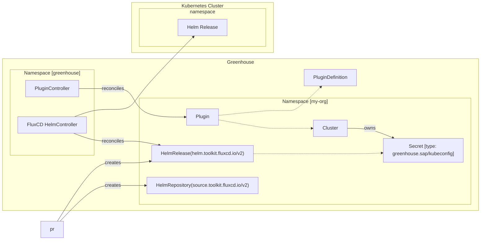

# 016-greenhouse-helm-controller-ng

- Status: [draft] <!-- optional -->
- Deciders: [list everyone involved in the decision] <!-- optional -->
- Date: [YYYY-MM-DD when the decision was last updated] <!-- optional. To customize the ordering without relying on Git creation dates and filenames -->
- Tags: [greenhouse / cloudoperators] <!-- optional -->
- Technical Story: [description | ticket/issue URL] <!-- optional -->

## Context and Problem Statement

Greenhouse uses [helm.sh](https://helm.sh/docs/) to deploy the Plugins to Kubernetes Clusters. The Helm lifecycle is implemented in the Helm Controller. The Helm Controller is a simple controller that deploys the Chart and rolls it back if it fails. It does not handle releases stuck in Pending, releases constantly failing, or rollback to previous versions.

There have been various occasions where this controller has not been able to handle the lifecycle of the Helm releases. This has led to manual intervention to fix the releases.

Examples of issues:

- Helm releases stuck in Pending
- Helm releases constantly failing
- Helm Charts always producing a new `helm diff` between two deployments
- Helm Charts not rolling back to the previous version, in case the initial install fails

There are two options to solve this problem:

1. Invest more development time into the existing Helm Controller to make it more robust and support all the above features.
2. Replace the Helm Controller with a more robust solution that can handle the above features.

## Decision Drivers <!-- optional -->

- Simplicity:
  - The solution should work without any enduser facing changes.
- Control:
  - The solution should allow to control the lifecycle of the Helm releases.
- Stability:
  - The solution should be stable and reliable.
  - The lifecycle of the Helm releases should be handled correctly.
- Development cost:
  - Time spend on the development of the solution.

## Considered Options

- Helm Controller with more development time
- FluxCD Helm Operator
- [option 3]
- … <!-- numbers of options can vary -->

## Decision Outcome

Chosen option: "[option 1]",
because [justification. e.g., only option, which meets k.o. criterion decision driver | which resolves force force | … | comes out best (see below)].

### Positive Consequences <!-- optional -->

- [e.g., improvement of quality attribute satisfaction, follow-up decisions required, …]
- …

### Negative Consequences <!-- optional -->

- [e.g., compromising quality attribute, follow-up decisions required, …]
- …

## Pros and Cons of the Options | Evaluation of options <!-- optional -->

### Helm Controller with more development time

The Helm controller supports the basic lifecycle around Helm actions. The Helm actions such as `install`, `upgrade`, `delete`, `rollback`, `diff` are already provided by upstream Helm. This means the controller manages the install, upgrade, and delete of a Plugin's Helm releases. Furthermore, it can diff the Helm release and rollback in case the prevoius upgrade fails.

Currently there is a list of features that is not supported:

- handling releases stuck with a pending status
- releases constantly failing (exponential backoff, but no circuit breaker/ limit of retries)
- rollback to previous versions on-demand
- circuit breaker for releases that constantly create a new diff
- ... anything else that we might need in the future

| Decision Driver     | Rating | Reason                        |
|---------------------|--------|-------------------------------|
| Simplicity | +++    | Good, because virtually no changes for the enduser.    |                                                                                                                                                                                                                                                                | 
| Control | ++    | Good, because we have the whole source code, besides upstream helm, under our control.    |
| Stability | o     | Neutral, because the current state of the controller is lacking some key features. We only have limited time and a limited amount of hands to keep working on the Helm Controller.     |
| Development cost | --      | Negative, because there are a multitude of features missing to make the controller work reliable and to support the full plugin lifecycle. |

### FluxCD Helm Operator

[FluxCD](https://github.com/fluxcd/flux2) provides a suite of controllers around the lifecycle of Helm Releases. These controllers are proven to be stable and reliable.

In order to replace the HelmController which Greenhouse uses, it is necessary to create Flux CRDs from the Plugin. This can be done by implementing a new controller that works with the Plugin CRDs.

The flow for the interaction between the Greenhouse and the FluxCD Helm Operator can look as follows:

The enduser facing changes are none. All the data required by the FluxCD Helm Operator is already present in the Plugin, PluginDefinition and Cluster CRDs.
The flux resources in the org namespace can even be hidden from the enduser, as they should be managed only by Greenhouse. The enduser should only see the status of Flux's HelmRelease resource reflected in the Plugin's status.

| Decision Driver     | Rating | Reason                        |
|---------------------|--------|-------------------------------|
| Simplicity | +++    | Good, because there are no changes for the enduser    |                                                                                                                                                                                                                                                                | 
| Control | -    | Negative, while FluxCD is open-source there is no guarantee to have proposed a feature request or bug fix merged. |
| Stability | +++     | Good, because this is a proven solution that is widely adopted in the CNCF landscape.     |
| Development cost |   o/-   | Neutral/Negative, because there is development effort to implement the controller that translates from Greenhouse CRDs into Flux CRDs. Also the Status must be reliably be transferred back to the Plugin. Other existing controllers (HelmTest, WorkloadStatus) may need to be adjusted. Another factor is the operations of the Flux controller(s) which is a continuous effort. |

### [option 3]

[example | description | pointer to more information | …] <!-- optional -->

| Decision Driver     | Rating | Reason                        |
|---------------------|--------|-------------------------------|
| [decision driver a] | +++    | Good, because [argument a]    |                                                                                                                                                                                                                                                                |
| [decision driver b] | ---    | Good, because [argument b]    |
| [decision driver c] | --     | Bad, because [argument c]     |
| [decision driver d] | o      | Neutral, because [argument d] |

## Related Decision Records <!-- optional -->

[previous decision record, e.g., an ADR, which is solved by this one | next decision record, e.g., an ADR, which solves this one | … | pointer to more information]

## Links <!-- optional -->

- [Link type](link to adr) <!-- example: Refined by [xxx](yyyymmdd-xxx.md) -->
- … <!-- numbers of links can vary -->
