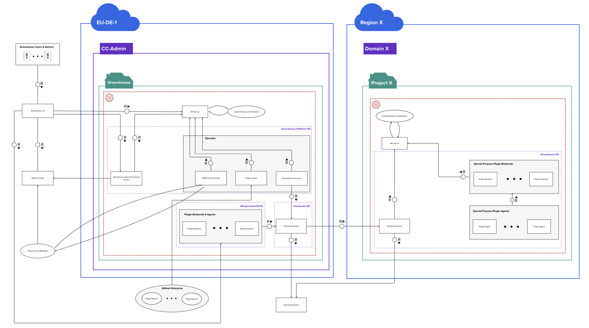
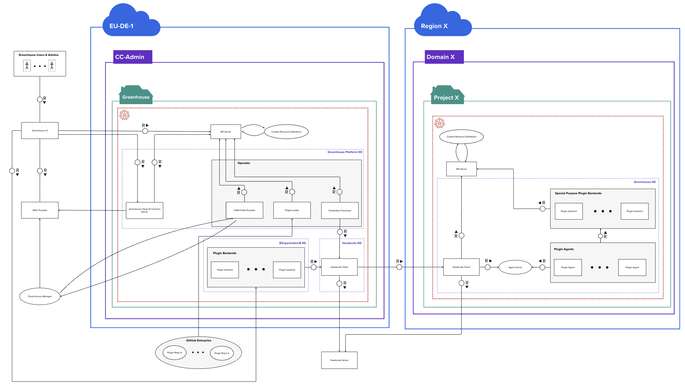
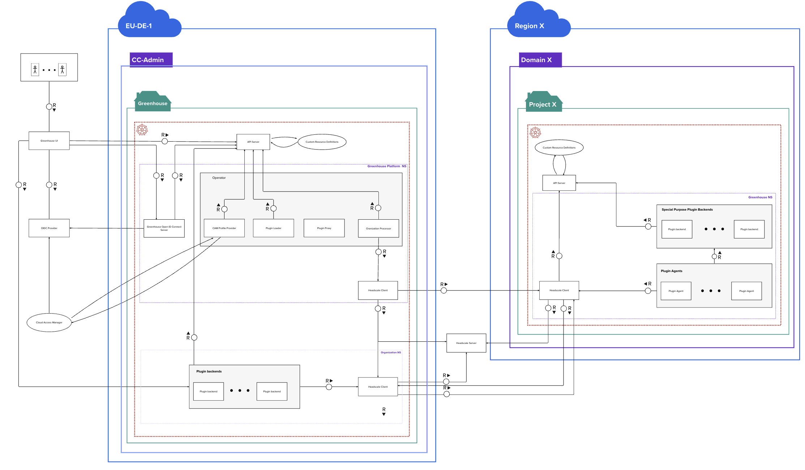
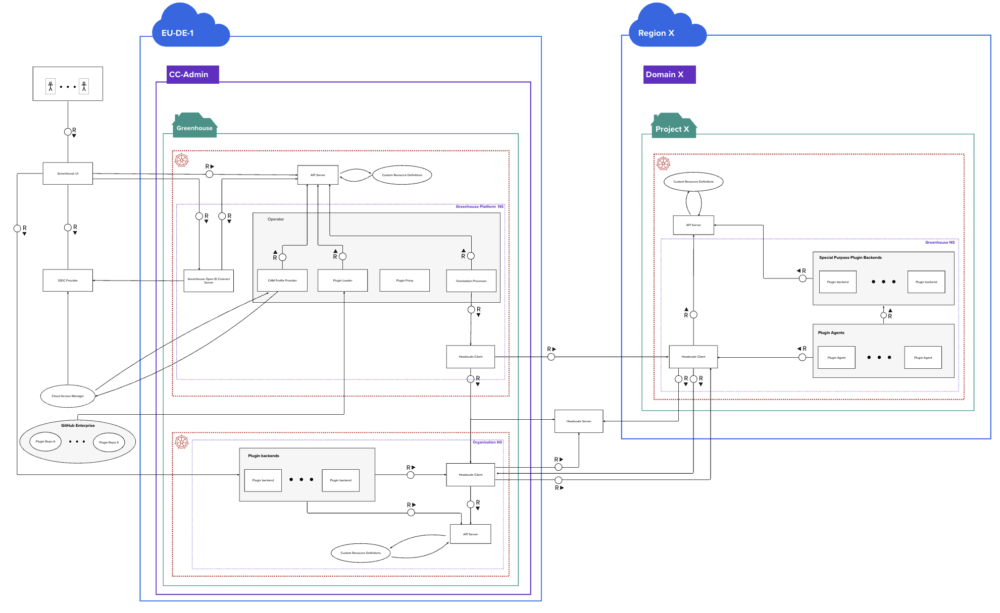
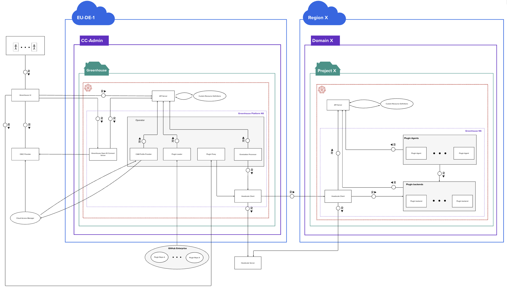

# ADR-3 Location of Greenhouse Backend Plugins in overarching Architecture

## Decision Contributors

* Fabian Ruff
* Esther Schmitz
* Arturo Reuschenbach
* Arno Uhlig
* Uwe Mayer
* David Rochow
* David Gogl

## Status

- In discussion

## Context and Problem Statement

During developement the question got raised whatever it is a good decision/architecture to run the Plugin Backends on the  Greenhouse Platform Cluster or if they rather should run in the "Customer Clusters". Furthermore it was unclear how communication from potential agents running on the customer cluster would communicate back to the Backends.
> (Arno)
> One key objective of Greenhouse is to continously manage Plugins in customer clusters.
>
> Ideally, the customer cluster is directly reachable from the operator from our Greenhouse cluster.
> However, this can not be guaranteed. In which case a reverse tunnel needs to be established from the customer cluster to our infrastructure.
> [Headscale](https://github.com/juanfont/headscale) is currently being evaluated for this purpose.
>
> A cluster exists within an organization and is thus namespaced.
> Onboarding of clusters is restricted to organization administrators.
>
> User story: Customer onboards a newly created cluster and requires an Ingress to expose applications. Via Greenhouse the Ingress Plugin can be configured which results in a deployment of the ingress controller within the customer cluster.
> The PluginConfig, dashboard reflects the  current status of relevant underlying resources.

## Related Decision Records

Superseded by [Greenhouse-ADR-6-central_cluster.md](Greenhouse-ADR-6-central_cluster.md)

## Decision Drivers

* Should work with/ focus on the for MVP in scope Applications
    * Do not put to much value in hypotethical assumptions of what may be (YAGNI)
* Architectural complexity
    * try to favor the "easiest" Solution from architectual complexity perspective (KISS)
* Operative support complexity
    * The complexity to provide operative support for Greenhouse Plugins should be as low as possible
* Plugin complexity
    * The solution should add no unnecessary complexity to the plugin configuration / setup for End Users
* Security
    * Consider security aspects in term of Isolation of Components and Blast Radius

## Considered Options

* Plugin Backends and Agents within Greenhouse Platform

* Plugin Backends within Greenhouse Platform with Agents running on Customer Cluster

* Plugin Backends within Greenhouse Platform using seperate Headscale client per Organization

* Plugin Backends within seperate Clusters

* Plugin Backends and Agents running on Customer Cluster

## Decision Outcome

We decided to go with:  TO BE DEFINED

### Consequences

**Good**
TO BE DEFINED

**Bad**
TO BE DEFINED

## Evaluation of Options

### [1] Plugin Backends and Agents within Greenhouse Platform

In this option the Plugin Backends as well as potential Agents are running on the Greenhouse Platform Cluster within the namespace of the respective Organization.
Potential "Special Purpose Backends" such as e.g. Monitoring Infrastructure can still run on the Customer Backend but would need to be exposed to be reachable for corresponding Plugin Frontends.

**Good**

* We are in full control of the Backends and Agents, and can similar to other Platform Core Components take full responsibility for those Components.
* As long as no Special Purpose Plugins are added it comes with the lowest Architectural complexity
* UI Components can directly speak to the Backends within our cluster
* Realatively easy from our side to operate and support as we have direct access to the reosurces / plugin backends

**Bad**

* Compromise of a Plugin Backend has a high potential Blast Radius as from there the customer clusters are reachable.
* Hard to delegate costs to customers
* IF we add "Special Purpose Plugins" in addition that run on the Customer Cluster this increases the complexity
* Increases the error surface for the customer, we could have:
    * Their cluster is down / has a problem
    * Our cluster is down / has a problem
    * The connection between the cluster is down/has a problem
* No possibility to add Agents that need to run on the Cluster / Cluster Nodes and feed data to the Backends runnin in our cluster

| Decision Driver   | Rating | Reason |
| -------- | -------- | -------- |
| Should work with/ focus on the for MVP in scope Applications | + + + | With the current MVP applications this will work without harnessing other drivers to much |
| Architectural complexity | + + + / - - | Easiest complexity / only as long as no special purpose Plugins involved |
| Operative support complexity | + + + / - - | Easiest operative support / as long as no Special purpose Plugins involved  |
| Plugin complexity | + + + / - - -  | Low plugin complexity for general Plugins / Special purpose Plugins need to include exposure (ingress etc.) on the customer cluster |
| Security | - - | Relative high Blast Radius of Plugin Backends and higher attack surface on the Platform |

### [2] Plugin Backends within Greenhouse Platform with Agents running on Customer Cluster

In this option the Plugin Backends are running on the Greenhouse Platform Cluster within the namespace of the respective Organization.  Agents can be deployed on the  customer cluster and they feed data to a "Plugin Cache" which can then be consumed by Plugin Backends on the Greenhouse Platform in a polling manner.
Potential "Special Purpose Backends" such as e.g. Monitoring Infrastructure can still run on the Customer Backend but would need to be exposed to be reachable for corresponding Plugin Frontends.

**Good**

* We are in control of the Backends, and can similar to other Platform Core Components take full responsibility for those Components.
* As long as no Special Purpose Plugins are added it comes with medium Architectural complexity (more in comparison to [1] due to agents & agent cache)
* UI Components can directly speak to the Backends within our cluster
* Realatively easy from our side to operate and support the backends as we have direct access to them.
* We won't loose any data if the Platform is down as agents would still collect data on the customer clusters

**Bad**

* In comparison to [1] there is a lot more complexity involved due to the Agents running on the Customer Cluster
* Compromise of a Plugin Backend has a high potential Blast Radius as from there the customer clusters are reachable.
* Hard to delegate costs to customers
* As Soon as we addd Agents to the customer Clusters we adding a lot of architectural and operatrional complexity
* IF we add "Special Purpose Plugins" in addition that run on the Customer Cluster this increases the complexity
* Increases the error surface for the customer, we could have:
    * Their cluster is down / has a problem
    * Our cluster is down / has a problem
    * The connection between the cluster is down/has a problem

| Decision Driver   | Rating | Reason |
| -------- | -------- | -------- |
| Should work with/ focus on the for MVP in scope Applications | +  | Considering that Heureka will have Agents there will be already added complexity in MVP to support all MVP apps in comparison to [1] |
| Architectural complexity | - / - - - | Plugin Agents on the Customer Cluster increasoing complexity / Special Purpose Plugin Backends would increase furthermore |
| Operative support complexity | - / - - - | Plugin Agents on the Customer Cluster increasoing complexity / Special Purpose Plugin Backends would increase furthermore  |
| Plugin complexity | + + + / - - - | Low plugin complexity for general Plugins / Special purpose Plugins need to include exposure (ingress etc.) on the customer cluster |
| Security | - | Relative high Blast Radius of Plugin Backends and higher attack surface on the Platform (a little lower due to Agents not running on our Cluster) |

### [3] Plugin Backends within Greenhouse Platform using seperate Headscale client per Organization

In this option the Plugin Backends are running on the Greenhouse Platform Cluster within the namespace of the respective Organization.  Agents can be deployed on the  customer cluster and they feed data to a "Plugin Cache" which can then be consumed by Plugin Backends on the Greenhouse Platform in a polling manner.
Potential "Special Purpose Backends" such as e.g. Monitoring Infrastructure can still run on the Customer Backend but would need to be exposed to be reachable for corresponding Plugin Frontends.

**Good**

* We are in control of the Backends, and can similar to other Platform Core Components take full responsibility for those Components.
* As long as no Special Purpose Plugins are added it comes with medium Architectural complexity (more in comparison to [1] due to agents & agent cache)
* UI Components can directly speak to the Backends within our cluster
* Realatively easy from our side to operate and support the backends as we have direct access to them.

**Bad**

* In comparison to [1] there is a lot more complexity involved due to the Agents running on the Customer Cluster
*  In comparison to [1] and [2] there is more complexity due to the seperate headscale client
* Hard to delegate costs to customers
* We have a channel back from the customer cluster to us
* IF we add "Special Purpose Plugins" in addition that run on the Customer Cluster this increases the complexity
* Increases the error surface for the customer, we could have:
    * Their cluster is down / has a problem
    * Our cluster is down / has a problem
    * The connection between the cluster is down/has a problem

| Decision Driver   | Rating | Reason |
| -------- | -------- | -------- |
| Should work with/ focus on the for MVP in scope Applications | +  | Considering that Heureka will have Agents there will be already added complexity in MVP to support all MVP apps in comparison to [1] |
| Architectural complexity | - - / - - - | Plugin Agents on the Customer Cluster as well as the dedicated Headscale Clients per Organization on our Cluster increasing complexity / Special Purpose Plugin Backends would increase furthermore |
| Operative support complexity | - - / - - - | Plugin Agents on the Customer Cluster increasing complexity , as well as the dedicated Headscale Clients per Organization on our Cluster/ Special Purpose Plugin Backends would increase furthermore  |
| Plugin complexity | + + + / - - - | Low plugin complexity for general Plugins / Special purpose Plugins need to include exposure (ingress etc.) on the customer cluster |
| Security | o | We still have a higher attack surface on Platform Cluster but the Plugin Backends are stricter isolated and the dedicated Headscale Client ensures the organization boundaries wich is reducing the  blast radius, on the other side we open a channel back into our cluster from the customer cluster |

### [4] Plugin Backends within seperate Clusters

This option is similar to option [3] with the difference that for stronger encapsulation we run seperate clusters fro Organizations instead of utilizing Namespaces for segregation

**Good**

* We are in control of the Backends, and can similar to other Platform Core Components take full responsibility for those Components.
* Increased Security due to higher seperation

**Bad**

* In comparison to [3] there is a lot more complexity involved on all layers due to the seperation by clusters
* IF we add "Special Purpose Plugins" in addition that run on the Customer Cluster this increases the complexity further
* Increases the error surface for the customer, we could have:
    * Their cluster is down / has a problem
    * Our cluster is down / has a problem
    * The backend cluster is down / has a problem
    * The connection between the cluster is down/has a problem

| Decision Driver   | Rating | Reason |
| -------- | -------- | -------- |
| Should work with/ focus on the for MVP in scope Applications | +  | Considering that Heureka will have Agents there will be already added complexity in MVP to support all MVP apps in comparison to [1] |
| Architectural complexity |- - - | Plugin Agents on the Customer Cluster as well as the dedicated Headscale Clients per Organization on our Cluster increasing complexity / Special Purpose Plugin Backends would increase furthermore |
| Operative support complexity | - - - | Plugin Agents on the Customer Cluster increasing complexity , as well as the dedicated Headscale Clients per Organization on our Cluster/ Special Purpose Plugin Backends would increase furthermore  |
| Plugin complexity |  - - - | Low plugin complexity for general Plugins / Special purpose Plugins need to include exposure (ingress etc.) on the customer cluster |
| Security | + | We still have a higher attack surface on Platform Cluster but the Plugin Backends are stricter isolated and the dedicated Headscale Client ensures the organization boundaries wich is reducing the  blast radius, on the other side we open a channel back into our cluster from the customer cluster |

### [5] Plugin Backends and Agents running on Customer Cluster

In this option all Plugin Backends run on the customer Clusters and the communication from the UI  to the Backends is going through a "Plugin Proxy" that is facilitating the Headsclae client to talk with the Plugin Backends to keep the "Plugin configuration complexity" reasonbable and avoid that all Plugin Backends need to include a ingress configuration to be reachable from outside.

**Good**

* We do not have to carry costs for backends
* No difference between special purpose and "normal" plugins
* Customer clusters fully operational when Greenhouse Platform would be down
* Best security posture of otpions
* Avoids conflicting cluster-scoped resources, foremost CRD

**Bad**

* Plugin Proxy and Headscale are critical components to reach the Plugin Backends
* The operational complexity is among the highest of all the options
    > (Arno) Complexity will increase for sure, since for the POC we limited ourselves to a single cluster.
* As customers can mess with the Plugin Backends on their cluster they could potentially make the Plugin Backends un-functional and then ask us for support for things they have messed up
  > (Arno) The PluginConfig defines the desired state. Underlying resources are being watched and reconciled until they match the desired state (Helm diff + drift detection) ensuring funcitionality.
* In case of multi cluster scenarios the plugin complexity increases dramatical as you need to define a "main" cluster and need to have a way that enables Agents from non-main clusters to talk to the main cluster.
  > (Arno) Ensuring connectivity between registered customer cluster is not part of the Greenhouse scope but a customer responsibility.
  Example: Prometheus federation. A large set of metrics being pulled from various Prometheis to and would be persisted in the central cluster. We want that in the customer cluster.

| Decision Driver   | Rating | Reason |
| -------- | -------- | -------- |
| Should work with/ focus on the for MVP in scope Applications | + | Works with all MVP products but for MVP more complex than ][1] |
| Architectural complexity | + | relatively clean Architectural but more complex than option [1] if no special purpose plugins are involved  |
| Operative support complexity | - - - | as the Plugin Backends are running on the customer cluster its hard for us to monitor them and we are required to go through the Headscale client to provide operative support |
| Plugin complexity | o | More complex then option [1] as the customer would need to configure in multi cluster scenarios where the Backend is actually living in and how agents can talk back to it.  |
| Security | + +  | We have a uni directional connection to the customer clusters and the most minimal attack surface on the Platform cluster  |

## Related Decision Records

### General comments (Arno)

* We go for  option 5 though headscale is not required if the cluster is directly accessible.
* One core goal of Greenhouse is to manage Plugins and related resources in all registered Kubernetes clusters. Thus no difference btwn. "special" and "normal" Plugins.
  Rather distinguish between Plugins with/without backend.
  During a transition phase (MVP) we allow plugin backends in the central cluster.
  Future: Plugins with backend require a customer cluster for the workload.
* Headscale coordination server downtime
    * Not critical until key expiration (1d). Registered clients continue to work.
    * New client cannot be added w/o coordination server though.
* Open topics:
    * Dashboard - customer cluster connectivity required?
    * Currently, we assume all relevant information is made transparent via the available CRDs (PluginConfig) in the central cluster. Thus the dashboard only needs to act within the Greenhouse central cluster.

n/A

