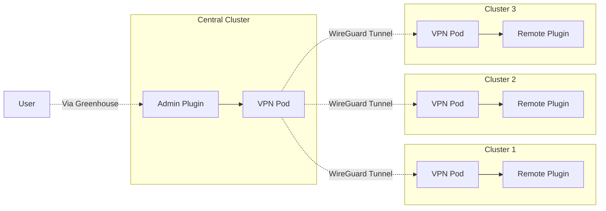
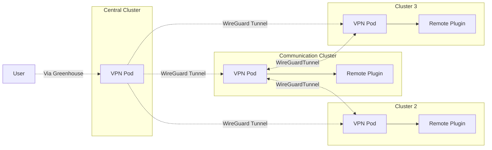
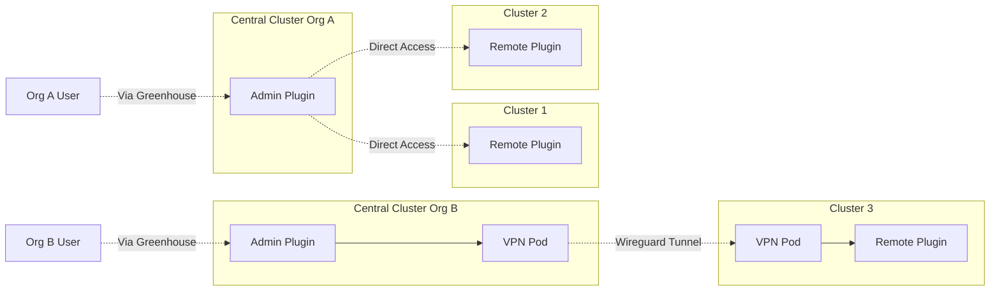

# ADR-6 Central cluster 

## Decision Contributors

- Arno Uhlig
- Ivo Gosemann
- David Rochow
- Martin Vossen
- David Gogl
- Fabian Ruff
- Richard Tief
- Tommy Sauer
- Timo Johner

## Status

- Proposed

## Context and Problem Statement

The central cluster in Greenhouse hosts non-organization specific core components as well as organization-specific metadata and configuration.
Organizations are isolated by namespaces and permissions (RBAC) are restricted to Greenhouse resource.  
Granting more permissions would increase the attack surface and introduce additional risks.

Another aspect to consider is billing.  
The shared nature of the central cluster and underlying infrastructure does not allow tenant-specific measurement and billing of consumed resources.  
Thus workload in the central cluster is charged on the provider.

Moreover, workload within the central cluster is neither transparent nor accessible to the customer. 
It cannot be configured, its metrics, logs, etc. are not exposed and access (kubectl exec/delete pod) is restricted.  
Thus operations of all workload within the central cluster is on the provider. 

From a network perspective and as documented in the security concept, communication is only uni-directional from the central to the remote clusters.  

Currently, the central Prometheus Alertmanager (AM) is being run within the central cluster for each organization as part of the alerts plugin.
Since Prometheus servers push alerts to the AM, it is exposed via an ingress resource incl. TLS certificates and DNS records.  
While this contributes to simplicity and easiness of use, this violates the security concept and introduces additional costs for the provider. 
Moreover, it assumes the network zone of the central Greenhouse cluster is a good fit across all organizations and cloud providers.  

Use cases being:
1) Prometheus Alertmanager for holistic alerting capabilities
2) Thanos query and ruler component for organization-wide access to decentralized metric stores   
3) Grafana/Plutono for holistic dashboards
4) Heureka having multiple agents running on multiple clusters and data beeing consumed centrally

## Related Decision Records

Supersedes [Greenhouse-ADR-3-location_of_plugins.md](Greenhouse-ADR-3-location_of_plugins.md)

## Decision Drivers

* **Network Compatibility**  
  It assumes that the network zone of the central Greenhouse cluster is suitable for all organizations and cloud providers.

* **Security aspects**  
  Increased permissions and capabilities enlarge the attack surface, introducing risks.

* **Operational concerns**  
  User-configurable workloads in the central cluster are not transparent to customers and must be managed by the Greenhouse team.

* **Billing**  
  Tenant-specific resources must be charged to the respective tenant.

* **Easiness of use**  
  Greenhouse should offer an easy way to manage operational aspects with a low entry barrier.

## Decision

Go with Option 1 - Central Admin Plugins:
  * No user-configurable plugins should be allowed in the Greenhouse central cluster.
  * Maintain restrictive permissions within the central cluster limited to Greenhouse resources.
  * Introduce `AdminPlugins` to utilize the plugin concept for handling core responsibilities.   
    They cannot be configured by a user and are fully managed by Greenhouse.
  * A customer has to onboard at least one cluster to instantiate plugins with a backend.  

---

## Evaluated options, technical details, etc.

### Option 1: Central Admin Plugins

* No user-configurable plugins should be allowed in the Greenhouse central cluster.
* Maintain restrictive permissions within the central cluster limited to Greenhouse resources.
* Introduce `AdminPlugins` to utilize the plugin concept for handling core responsibilities.   
  They cannot be configured by a user and are fully managed by Greenhouse.
* A customer has to onboard at least one cluster to instantiate plugins with a backend.

#### Pros

* operational well manageable from Greenhouse
* the limitations to admin plugins ensure that no misconfiguration by consumer is possible
* works with "store local query global" scenarios

#### Contra 

* Puts a hard dependency to the central cluster availability for all plugins with a backend
  * is that already the case??
* Limits decentralization of Greenhouse applications
* Additional effort required to make central data collection scenarios work

### Option 2: Per Org Central Communication cluster

* Each organization has its own communication cluster
* Communication cluster is responsible for establishing communication capability between clusters and establishes bi-directional connections
* Commnunication cluster is owned by respective organization / consumer
* No Plugins are allowed on the Communication Cluster nor on the Central Cluster
* As before no cluster is allowed to communicate with the central cluster

#### Pros 

* allows consumers to establish full interconnectivity between clusters
* enables common use case for plugins where data is collected decentrally and stored centrally 
* all plugins live in the consumer clusters

#### Contra

* additional operational complexity
* consumers may rely on the interconnectivity solution for other applications then greenhouse increasing blast radius of potential misconfigurations 
* additional security risk for consumers as interconnected clusters potentially allow attackers to move between remote clusters

### Option 3: Greenhouse Cluster per Organization

- Each organization has their own central cluster, owned and operated by them
- Greenhouse (eventually) also provides a Managed Greenhouse Central Cluster
- Admin plugins are allowed in the central cluster, and may be configured by the organization
- Access to previously shared Greenhouse components possible

#### Pros

- Organization can choose a suitable network zone for their central cluster, allowing for direct access to Clusters
- No dependencies between Orgs on AdminPlugin updates due to CRD changes
- Organization can configure AdminPlugins to their needs
- Access to Greenhouse Logs & Metrics available
- No shared costs that are not billable to the organization
- Can be run on a trial period to evaluate the concept, as this can be reverted into the current state if needed

#### Contra

- Harder to support Organizations without access to their Greenhouse Central Cluster
- No longer a OOB solution for Organizations
- Increased operation complexity for Organizations
